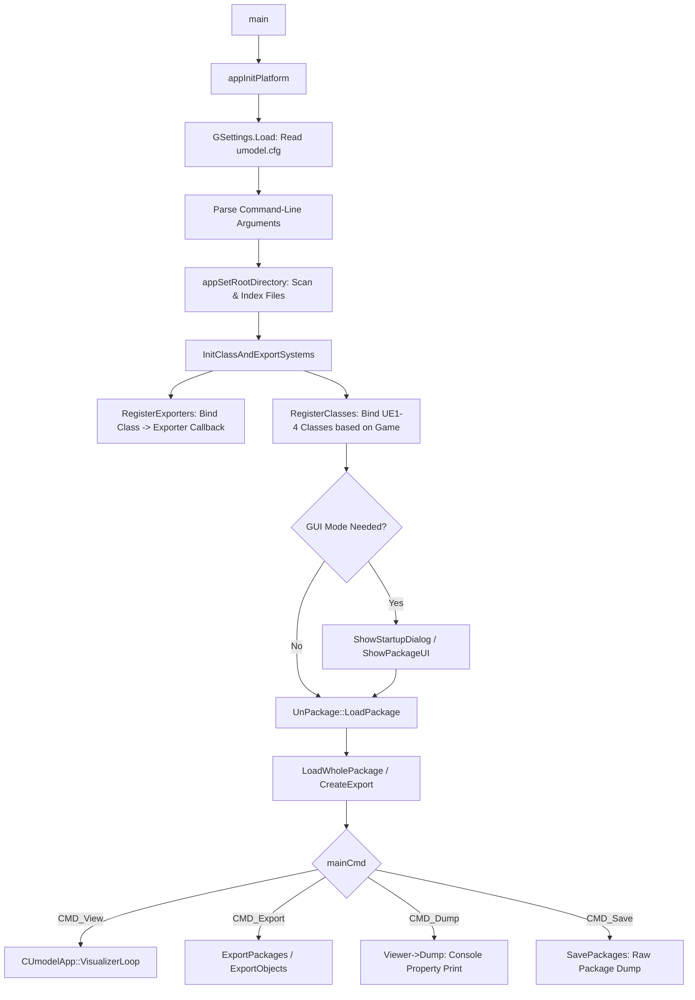
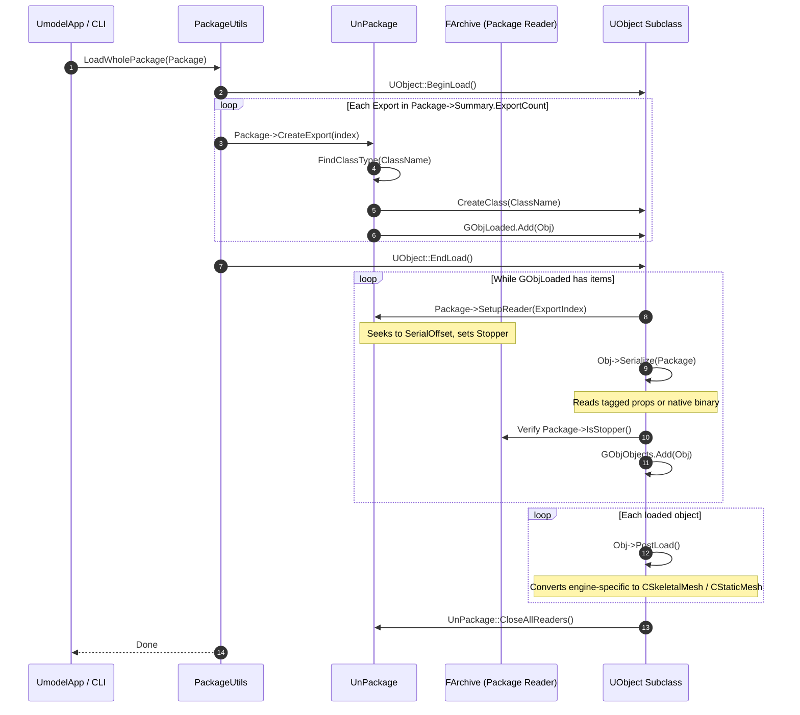
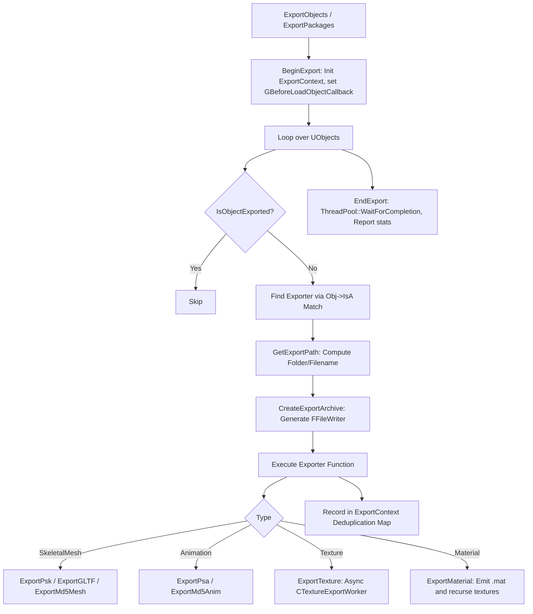
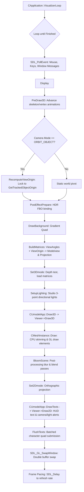

# UEViewer (UModel) — Codebase Architecture Map

> **Purpose**: Persistent reference for AI coding tasks and architectural comprehension.
> Use this document to navigate the codebase, understand module relationships, trace data flow, assess change impacts, and locate key symbols without re-analyzing the entire project.
>
> **Source of Truth**: Actual source code, headers, build definitions, and configuration files in this repository.
> **Date**: 2026-09-05 | **Status**: Verified against codebase | **Uncertainties**: Marked as `UNKNOWN` where applicable.

---

## Table of Contents

1. [Project & Module Structure](#1-project--module-structure)
2. [Source Files and Their Responsibilities](#2-source-files-and-their-responsibilities)
3. [Header / Include Relationships](#3-header--include-relationships)
4. [Classes, Structs, Enums, and Important Types](#4-classes-structs-enums-and-important-types)
5. [Important Functions and Call Relationships / Flow](#5-important-functions-and-call-relationships--flow)
6. [Global & Static State and Ownership](#6-global--static-state-and-ownership)
7. [Data Flow Between Major Modules](#7-data-flow-between-major-modules)
8. [Threading and Concurrency Relationships](#8-threading-and-concurrency-relationships)
9. [Memory Ownership and Lifetime Patterns](#9-memory-ownership-and-lifetime-patterns)
10. [APIs and Interfaces Between Modules](#10-apis-and-interfaces-between-modules)
11. [External Libraries and System Dependencies](#11-external-libraries-and-system-dependencies)
12. [Build System and Important Compile Definitions](#12-build-system-and-important-compile-definitions)
13. [Entry Points and Execution Flow](#13-entry-points-and-execution-flow)
14. [Important Configuration and Macros](#14-important-configuration-and-macros)
15. [Tests and What They Cover](#15-tests-and-what-they-cover)
16. [Critical and High-Impact Files](#16-critical-and-high-impact-files)
17. [Circular Dependencies and Architectural Problems](#17-circular-dependencies-and-architectural-problems)
18. [Technical Debt and Suspicious / Fragile Areas](#18-technical-debt-and-suspicious--fragile-areas)
19. [Change-Impact Map](#19-change-impact-map)
20. [Hierarchical Mind Map of C/C++ Architecture](#20-hierarchical-mind-map-of-cc-architecture)

---

## 1. Project & Module Structure

UEViewer (executable: `umodel` / `umodel_64`) is a multi-format visualizer, package browser, and asset extraction toolkit for games developed on **Unreal Engine 1, 2, 2.5, 3, and 4** (covering games from 1998 through modern UE4.27 releases and custom branches like *Wuthering Waves*).

### High-Level Directory Taxonomy

```
c:\Users\Kem\Documents\Coding\UEViewer\
├── Core/                   # Foundation runtime: memory, math, threads, GL, platform shims
│   └── GL/                 # GL binding code generator (Perl) & OpenGL spec tables
├── Unreal/                 # Core engine abstraction, package loading, reflection, asset types
│   ├── FileSystem/         # Virtual File Systems (PAK, IOStore UTOC/UCAS, OBB, loose files)
│   ├── GameSpecific/       # Engine/game custom codecs (Batman, Bioshock, Havok, Rune, Ubisoft)
│   ├── Mesh/               # Canonical engine-independent mesh/anim structures (CSkeletalMesh, etc.)
│   ├── Shaders/            # Source GLSL shaders (.ush) compiled into C headers
│   ├── UnrealMaterial/     # Material & texture parsers across UE generations
│   ├── UnrealMesh/         # Versioned mesh serializers (UE1, UE2, UE3, UE4)
│   ├── UnrealPackage/      # Package loaders, summary serializers, export/import linkers
│   └── Wrappers/           # External codec bridges (libpng, NVTT DDS)
├── Exporters/              # Asset exporters (PSK/PSA, MD5, glTF, TGA, PNG, DDS, WAV, GFX)
├── MeshInstance/           # Runtime mesh evaluation, CPU skinning, LOD dispatch, GL drawing
├── Viewers/                # 3D interactive viewports (Mesh, Skeletal, Static, Material, Vertex)
├── UI/                     # Custom declarative Win32 UI framework (BaseDialog, widgets, menus)
├── UmodelTool/             # Application entry point, CLI parser, dialogs, application state
│   └── res/                # Windows resources (umodel.rc, icons, application manifests)
├── Tools/                  # Standalone CLI utilities and build generation scripts
│   ├── genmake             # Perl-based Makefile generator
│   ├── PackageExtract/     # Raw package asset dumper
│   ├── PackageTool/        # Package table inspection tool
│   ├── PackageUnpack/      # Compressed package unpacker
│   ├── TypeInfo/           # Reflection inspector
│   ├── UITest/             # Standalone test runner for the UI subsystem
│   ├── UmdExtract/         # Ubisoft UMD unpacker
│   └── MaxActorXImport/    # 3ds Max ActorX (PSK/PSA) import scripts
├── libs/                   # Bundled third-party libraries (source + prebuilts)
├── Docs/                   # Technical documents, format notes, FAQ
├── build.sh                # Main POSIX/Bash build orchestration script
├── build_win64.bat         # Automated MSVC x64 build script (installs BuildTools if needed)
├── common.project          # Core project compiler/linker configuration rules
└── test.sh                 # Multi-game regression and extraction verification test runner
```

### Module Dependency Layers

```
Layer 4: Application    [ UmodelTool ] (Entry point, CLI, Dialogs, Commands)
                             │
Layer 3: Presentation   [ Viewers ] ──► [ MeshInstance ]        [ UI ] (Win32 GUI)
                             │                 │                   │
Layer 2: Processing     [ Exporters ] ◄────────┼───────────────────┤
                             │                 │                   │
Layer 1: Engine Model   [ Unreal ] (Packages, Meshes, Materials, FileSystem, RTTI)
                             │
Layer 0: Foundation     [ Core ] (Memory, Threads, Math3D, OpenGL, Platform)
                             │
Third-Party             [ libs/ ] (SDL2, zlib, lzo, lz4, oodle, acl, libpng, nvtt, detex...)
```

---

## 2. Source Files and Their Responsibilities

### 2.1 Core Module (`Core/`)
Foundational runtime primitives, OS abstraction, math, memory, threading, and OpenGL windowing:

- [`Core.h`](file:///c:/Users/Kem/Documents/Coding/UEViewer/Core/Core.h): Primary project-wide include. Fixed-width integer types (`byte`, `int32`, `uint64`), SEH/C++ exception macros (`guard`/`unguard`), string formatting macros, memory allocator exports, Tracy profiler hooks, includes [`Math3D.h`](file:///c:/Users/Kem/Documents/Coding/UEViewer/Core/Math3D.h).
- [`Core.cpp`](file:///c:/Users/Kem/Documents/Coding/UEViewer/Core/Core.cpp): Error dispatch ([`appError`](file:///c:/Users/Kem/Documents/Coding/UEViewer/Core/Core.cpp#L73), [`appNotify`](file:///c:/Users/Kem/Documents/Coding/UEViewer/Core/Core.cpp#L125), [`appPrintf`](file:///c:/Users/Kem/Documents/Coding/UEViewer/Core/Core.cpp#L39)), callstack unwind recording ([`CErrorContext`](file:///c:/Users/Kem/Documents/Coding/UEViewer/Core/Core.h#L518)), string manipulation (`va()`, `appStrncpyz()`, `appStristr()`), wildcard matching (`appMatchWildcard()`), response file (`@args.txt`) parser.
- [`CoreWin32.cpp`](file:///c:/Users/Kem/Documents/Coding/UEViewer/Core/CoreWin32.cpp): Win32 Structured Exception Handling (`win32ExceptFilter()`), DbgHelp symbol extraction, callstack capture (`RtlCaptureStackBackTrace`), Windows clipboard interfacing, UCRT compatibility thunks.
- [`Math3D.h`](file:///c:/Users/Kem/Documents/Coding/UEViewer/Core/Math3D.h) / [`Math3D.cpp`](file:///c:/Users/Kem/Documents/Coding/UEViewer/Core/Math3D.cpp): 3D math types ([`CVec3`](file:///c:/Users/Kem/Documents/Coding/UEViewer/Core/Math3D.h#L33), [`CAxis`](file:///c:/Users/Kem/Documents/Coding/UEViewer/Core/Math3D.h#L185), [`CCoords`](file:///c:/Users/Kem/Documents/Coding/UEViewer/Core/Math3D.h#L212), [`CQuat`](file:///c:/Users/Kem/Documents/Coding/UEViewer/Core/Math3D.h#L260)), spherical linear interpolation (`Slerp()`), Euler rotators.
- [`MathSSE.h`](file:///c:/Users/Kem/Documents/Coding/UEViewer/Core/MathSSE.h): SSE SIMD acceleration vector types ([`CVec4`](file:///c:/Users/Kem/Documents/Coding/UEViewer/Core/MathSSE.h#L6), [`CCoords4`](file:///c:/Users/Kem/Documents/Coding/UEViewer/Core/MathSSE.h#L172)), fast packed byte weight unpacking.
- [`Memory.cpp`](file:///c:/Users/Kem/Documents/Coding/UEViewer/Core/Memory.cpp): Custom aligned heap allocator ([`appMalloc`](file:///c:/Users/Kem/Documents/Coding/UEViewer/Core/Memory.cpp#L130), [`appRealloc`](file:///c:/Users/Kem/Documents/Coding/UEViewer/Core/Memory.cpp#L223), [`appFree`](file:///c:/Users/Kem/Documents/Coding/UEViewer/Core/Memory.cpp#L284)), global C++ operator `new`/`delete` overloads, chunked arena allocator ([`CMemoryChain`](file:///c:/Users/Kem/Documents/Coding/UEViewer/Core/Core.h#L396)), debug leak tracker with callstack hashing.
- [`Parallel.h`](file:///c:/Users/Kem/Documents/Coding/UEViewer/Core/Parallel.h) / [`Parallel.cpp`](file:///c:/Users/Kem/Documents/Coding/UEViewer/Core/Parallel.cpp): OS synchronization primitives ([`CMutex`](file:///c:/Users/Kem/Documents/Coding/UEViewer/Core/Parallel.h#L17), [`CSemaphore`](file:///c:/Users/Kem/Documents/Coding/UEViewer/Core/Parallel.h#L57), [`CThread`](file:///c:/Users/Kem/Documents/Coding/UEViewer/Core/Parallel.h#L81)), persistent thread pool ([`ThreadPool`](file:///c:/Users/Kem/Documents/Coding/UEViewer/Core/Parallel.h#L272)), work-stealing parallel loop driver ([`ParallelFor`](file:///c:/Users/Kem/Documents/Coding/UEViewer/Core/Parallel.h#L427)), cross-platform compiler atomic primitives.
- [`CoreGL.h`](file:///c:/Users/Kem/Documents/Coding/UEViewer/Core/CoreGL.h) / [`CoreGL.cpp`](file:///c:/Users/Kem/Documents/Coding/UEViewer/Core/CoreGL.cpp): OpenGL context state descriptor ([`gl_config_t`](file:///c:/Users/Kem/Documents/Coding/UEViewer/Core/CoreGL.h#L26)), context loss generation counters, GLSL shader compiler/linker ([`CShader`](file:///c:/Users/Kem/Documents/Coding/UEViewer/Core/CoreGL.h#L90)), Framebuffer Object wrapper ([`CFramebuffer`](file:///c:/Users/Kem/Documents/Coding/UEViewer/Core/CoreGL.h#L211)), optional `glslang.dll` validation.
- [`GLBind.h`](file:///c:/Users/Kem/Documents/Coding/UEViewer/Core/GLBind.h), [`GLBindImpl.h`](file:///c:/Users/Kem/Documents/Coding/UEViewer/Core/GLBindImpl.h), [`GLBind.cpp`](file:///c:/Users/Kem/Documents/Coding/UEViewer/Core/GLBind.cpp): Dynamic OpenGL entry-point loader via `SDL_GL_GetProcAddress`, extension capability parser.
- [`GlFont.h`](file:///c:/Users/Kem/Documents/Coding/UEViewer/Core/GlFont.h), [`GLText.h`](file:///c:/Users/Kem/Documents/Coding/UEViewer/Core/GLText.h), [`GLText.cpp`](file:///c:/Users/Kem/Documents/Coding/UEViewer/Core/GLText.cpp): Embedded Consolas 14 font decompressor, 2D HUD text layout, color escapes (`^0`-`^9`), interactive mouse-clickable hyperlink hit testing.
- [`GlWindow.h`](file:///c:/Users/Kem/Documents/Coding/UEViewer/Core/GlWindow.h) / [`GlWindow.cpp`](file:///c:/Users/Kem/Documents/Coding/UEViewer/Core/GlWindow.cpp): Visualizer lifecycle class ([`CApplication`](file:///c:/Users/Kem/Documents/Coding/UEViewer/Core/GlWindow.h#L15)), SDL2 window & OpenGL context creation, camera orbit/pan/zoom math with multi-mode support (`CAMERA_MODE_FREE` stationary vs `CAMERA_MODE_ORBIT_OBJECT` Blender-style object tracking), zero-lag `PreDraw3D` pre-matrix animation sync, 3-point studio lighting, Bloom post-processing pipeline, double-buffered frame presentation.
- [`TextContainer.h`](file:///c:/Users/Kem/Documents/Coding/UEViewer/Core/TextContainer.h) / [`TextContainer.cpp`](file:///c:/Users/Kem/Documents/Coding/UEViewer/Core/TextContainer.cpp): Static sequential string/record bump-buffer.
- [`Win32Types.h`](file:///c:/Users/Kem/Documents/Coding/UEViewer/Core/Win32Types.h): Isolated Win32 handle types (`HANDLE`, `HWND`, `HDC`, etc.) preventing `<windows.h>` macro pollution.

---

### 2.2 Unreal Engine Abstraction Module (`Unreal/`)
Package deserialization, type reflection, virtual file systems, and engine asset abstractions:

#### Root Files
- [`UnCore.h`](file:///c:/Users/Kem/Documents/Coding/UEViewer/Unreal/UnCore.h) (~2816 lines): Engine-wide root header. Defines [`FArchive`](file:///c:/Users/Kem/Documents/Coding/UEViewer/Unreal/UnCore.h#L535), [`FName`](file:///c:/Users/Kem/Documents/Coding/UEViewer/Unreal/UnCore.h#L260), [`TArray<T>`](file:///c:/Users/Kem/Documents/Coding/UEViewer/Unreal/UnCore.h#L1587), [`TMap<K,V>`](file:///c:/Users/Kem/Documents/Coding/UEViewer/Unreal/UnCore.h#L2190), [`FString`](file:///c:/Users/Kem/Documents/Coding/UEViewer/Unreal/UnCore.h#L2253), [`CGameFileInfo`](file:///c:/Users/Kem/Documents/Coding/UEViewer/Unreal/UnCore.h#L91), [`FByteBulkData`](file:///c:/Users/Kem/Documents/Coding/UEViewer/Unreal/UnCore.h#L2609), [`EGame`](file:///c:/Users/Kem/Documents/Coding/UEViewer/Unreal/UnCore.h#L349) enum (100+ titles), file registry APIs.
- [`UnCore.cpp`](file:///c:/Users/Kem/Documents/Coding/UEViewer/Unreal/UnCore.cpp): String pool management ([`appStrdupPool`](file:///c:/Users/Kem/Documents/Coding/UEViewer/Unreal/UnCore.cpp#L515)), [`FArray`](file:///c:/Users/Kem/Documents/Coding/UEViewer/Unreal/UnCore.cpp#L45) reallocations, half-float to float converter.
- [`UnCoreSerialize.cpp`](file:///c:/Users/Kem/Documents/Coding/UEViewer/Unreal/UnCoreSerialize.cpp): Concrete archive implementations ([`FFileReader`](file:///c:/Users/Kem/Documents/Coding/UEViewer/Unreal/UnCoreSerialize.cpp#L614), [`FFileWriter`](file:///c:/Users/Kem/Documents/Coding/UEViewer/Unreal/UnCoreSerialize.cpp#L765), [`FMemReader`](file:///c:/Users/Kem/Documents/Coding/UEViewer/Unreal/UnCoreSerialize.cpp#L1050), [`FMemWriter`](file:///c:/Users/Kem/Documents/Coding/UEViewer/Unreal/UnCoreSerialize.cpp#L1100)), [`FCompactIndex`](file:///c:/Users/Kem/Documents/Coding/UEViewer/Unreal/UnCoreSerialize.cpp#L44), [`FString`](file:///c:/Users/Kem/Documents/Coding/UEViewer/Unreal/UnCoreSerialize.cpp#L1122), and bulk data block serializers.
- [`UnCoreCompression.cpp`](file:///c:/Users/Kem/Documents/Coding/UEViewer/Unreal/UnCoreCompression.cpp): Central decompression router ([`appDecompress`](file:///c:/Users/Kem/Documents/Coding/UEViewer/Unreal/UnCoreCompression.cpp#L441)) binding Zlib, miniLZO, libmspack (LZX), LZ4, and RAD Game Tools Oodle.
- [`UnCoreDecrypt.cpp`](file:///c:/Users/Kem/Documents/Coding/UEViewer/Unreal/UnCoreDecrypt.cpp): Custom cipher implementations for encrypted MMO packages (Blade & Soul, Tao Yuan, Devil's Third).
- [`UnObject.h`](file:///c:/Users/Kem/Documents/Coding/UEViewer/Unreal/UnObject.h) / [`UnObject.cpp`](file:///c:/Users/Kem/Documents/Coding/UEViewer/Unreal/UnObject.cpp): Base class [`UObject`](file:///c:/Users/Kem/Documents/Coding/UEViewer/Unreal/UnObject.h#L11), export queue management ([`BeginLoad`](file:///c:/Users/Kem/Documents/Coding/UEViewer/Unreal/UnObject.cpp#L142), [`EndLoad`](file:///c:/Users/Kem/Documents/Coding/UEViewer/Unreal/UnObject.cpp#L149)), tagged property deserializer ([`SerializeUnrealProps`](file:///c:/Users/Kem/Documents/Coding/UEViewer/Unreal/UnObject.cpp#L400)), dynamic class factory ([`CreateClass`](file:///c:/Users/Kem/Documents/Coding/UEViewer/Unreal/UnObject.cpp#L1960)).
- [`UnObject4.cpp`](file:///c:/Users/Kem/Documents/Coding/UEViewer/Unreal/UnObject4.cpp): UE4.26+ unversioned property loader ([`SerializeUnversionedProperties4`](file:///c:/Users/Kem/Documents/Coding/UEViewer/Unreal/UnObject4.cpp#L400)) with hardcoded schema layouts.
- [`TypeInfo.h`](file:///c:/Users/Kem/Documents/Coding/UEViewer/Unreal/TypeInfo.h) / [`TypeInfo.cpp`](file:///c:/Users/Kem/Documents/Coding/UEViewer/Unreal/TypeInfo.cpp): RTTI descriptor structures ([`CTypeInfo`](file:///c:/Users/Kem/Documents/Coding/UEViewer/Unreal/TypeInfo.h#L124), [`CPropInfo`](file:///c:/Users/Kem/Documents/Coding/UEViewer/Unreal/TypeInfo.h#L91)), global class registry (`GClasses`), property remap overrides.
- [`UnTypeinfo.h`](file:///c:/Users/Kem/Documents/Coding/UEViewer/Unreal/UnTypeinfo.h): Native Unreal reflection field structures ([`UField`](file:///c:/Users/Kem/Documents/Coding/UEViewer/Unreal/UnTypeinfo.h#L35), [`UStruct`](file:///c:/Users/Kem/Documents/Coding/UEViewer/Unreal/UnTypeinfo.h#L126), [`UClass`](file:///c:/Users/Kem/Documents/Coding/UEViewer/Unreal/UnTypeinfo.h#L244), [`UProperty`](file:///c:/Users/Kem/Documents/Coding/UEViewer/Unreal/UnTypeinfo.h#L259) and subclasses).
- [`GameDatabase.h`](file:///c:/Users/Kem/Documents/Coding/UEViewer/Unreal/GameDatabase.h) / [`GameDatabase.cpp`](file:///c:/Users/Kem/Documents/Coding/UEViewer/Unreal/GameDatabase.cpp): Master registry table of games (`GListOfGames`), engine version mapping, auto-detection heuristics ([`DetectGame`](file:///c:/Users/Kem/Documents/Coding/UEViewer/Unreal/GameDatabase.cpp#L800)), version overrides ([`OverrideVersion`](file:///c:/Users/Kem/Documents/Coding/UEViewer/Unreal/GameDatabase.cpp#L999)).
- [`GameDefines.h`](file:///c:/Users/Kem/Documents/Coding/UEViewer/Unreal/GameDefines.h): Master preprocessor feature switches for engine generations (`UNREAL1`-`UNREAL4`), target platforms, and individual games.
- [`UE4Version.h`](file:///c:/Users/Kem/Documents/Coding/UEViewer/Unreal/UE4Version.h): UE4 file version constants (112 to 522) and custom version GUID identifiers.
- [`UnRenderer.cpp`](file:///c:/Users/Kem/Documents/Coding/UEViewer/Unreal/UnRenderer.cpp): Material parameters compilation, OpenGL texture uploading, mipmap filtering setup.
- [`Shaders.h`](file:///c:/Users/Kem/Documents/Coding/UEViewer/Unreal/Shaders.h): Preprocessed C string arrays containing compiled GLSL shader source.
- [`TypeConvert.h`](file:///c:/Users/Kem/Documents/Coding/UEViewer/Unreal/TypeConvert.h): Fast inline type casting between Core math types and Unreal serialized structures.
- [`UnSound.h`](file:///c:/Users/Kem/Documents/Coding/UEViewer/Unreal/UnSound.h): Audio asset definitions: [`USound`](file:///c:/Users/Kem/Documents/Coding/UEViewer/Unreal/UnSound.h#L6) (UE1/2), [`USoundNodeWave`](file:///c:/Users/Kem/Documents/Coding/UEViewer/Unreal/UnSound.h#L33) (UE3), [`USoundWave`](file:///c:/Users/Kem/Documents/Coding/UEViewer/Unreal/UnSound.h#L157) (UE4).
- [`UnThirdParty.h`](file:///c:/Users/Kem/Documents/Coding/UEViewer/Unreal/UnThirdParty.h): Scaleform Flash (`USwfMovie`) and FaceFX assets (`UFaceFXAnimSet`, `UFaceFXAsset`).

#### `FileSystem/` Subdirectory
- [`GameFileSystem.h`](file:///c:/Users/Kem/Documents/Coding/UEViewer/Unreal/FileSystem/GameFileSystem.h) / [`GameFileSystem.cpp`](file:///c:/Users/Kem/Documents/Coding/UEViewer/Unreal/FileSystem/GameFileSystem.cpp): Disk scanning, directory traversal, VFS container discovery, hash index creation for instant asset lookup.
- [`FileSystemUtils.h`](file:///c:/Users/Kem/Documents/Coding/UEViewer/Unreal/FileSystem/FileSystemUtils.h) / [`FileSystemUtils.cpp`](file:///c:/Users/Kem/Documents/Coding/UEViewer/Unreal/FileSystem/FileSystemUtils.cpp): Path normalization, mount point verification.
- [`UnArchivePak.h`](file:///c:/Users/Kem/Documents/Coding/UEViewer/Unreal/FileSystem/UnArchivePak.h) / [`UnArchivePak.cpp`](file:///c:/Users/Kem/Documents/Coding/UEViewer/Unreal/FileSystem/UnArchivePak.cpp): UE4 `.pak` archive deserializer supporting format versions 1 through 11, index AES decryption, chunk decompression.
- [`IOStoreFileSystem.h`](file:///c:/Users/Kem/Documents/Coding/UEViewer/Unreal/FileSystem/IOStoreFileSystem.h) / [`IOStoreFileSystem.cpp`](file:///c:/Users/Kem/Documents/Coding/UEViewer/Unreal/FileSystem/IOStoreFileSystem.cpp): UE4.26+ / UE5 Zen IO Store container reader (`.utoc` / `.ucas`), container headers, directory index reader.
- [`UnArchiveObb.h`](file:///c:/Users/Kem/Documents/Coding/UEViewer/Unreal/FileSystem/UnArchiveObb.h): Android `.obb` (ZIP format) virtual file system reader.
- [`GameFileSystemGears4.cpp`](file:///c:/Users/Kem/Documents/Coding/UEViewer/Unreal/FileSystem/GameFileSystemGears4.cpp): Custom container bundle loader for *Gears of War 4*.

#### `UnrealPackage/` Subdirectory
- [`UnPackage.h`](file:///c:/Users/Kem/Documents/Coding/UEViewer/Unreal/UnrealPackage/UnPackage.h) / [`UnPackage.cpp`](file:///c:/Users/Kem/Documents/Coding/UEViewer/Unreal/UnrealPackage/UnPackage.cpp): [`UnPackage`](file:///c:/Users/Kem/Documents/Coding/UEViewer/Unreal/UnrealPackage/UnPackage.h#L238) class (ULinkerLoad equivalent). Deserializes [`FPackageFileSummary`](file:///c:/Users/Kem/Documents/Coding/UEViewer/Unreal/UnrealPackage/UnPackage.h#L124), manages name, import, and export tables, executes [`CreateExport`](file:///c:/Users/Kem/Documents/Coding/UEViewer/Unreal/UnrealPackage/UnPackage.cpp#L974) and [`CreateImport`](file:///c:/Users/Kem/Documents/Coding/UEViewer/Unreal/UnrealPackage/UnPackage.cpp#L1095).
- [`UnPackage2.cpp`](file:///c:/Users/Kem/Documents/Coding/UEViewer/Unreal/UnrealPackage/UnPackage2.cpp), [`UnPackage3.cpp`](file:///c:/Users/Kem/Documents/Coding/UEViewer/Unreal/UnrealPackage/UnPackage3.cpp), [`UnPackage4.cpp`](file:///c:/Users/Kem/Documents/Coding/UEViewer/Unreal/UnrealPackage/UnPackage4.cpp): Engine generation-specific summary, name table, and export table loaders.
- [`UnPackageReader.cpp`](file:///c:/Users/Kem/Documents/Coding/UEViewer/Unreal/UnrealPackage/UnPackageReader.cpp): Loader instantiator and archive encryption/decompression wrapper router.
- [`UnPackageUE3Reader.h`](file:///c:/Users/Kem/Documents/Coding/UEViewer/Unreal/UnrealPackage/UnPackageUE3Reader.h): On-the-fly chunk reader for fully-compressed UE3 packages.
- [`PackageUtils.h`](file:///c:/Users/Kem/Documents/Coding/UEViewer/Unreal/UnrealPackage/PackageUtils.h) / [`PackageUtils.cpp`](file:///c:/Users/Kem/Documents/Coding/UEViewer/Unreal/UnrealPackage/PackageUtils.cpp): High-level operations: [`LoadWholePackage`](file:///c:/Users/Kem/Documents/Coding/UEViewer/Unreal/UnrealPackage/PackageUtils.cpp#L15), [`ReleaseAllObjects`](file:///c:/Users/Kem/Documents/Coding/UEViewer/Unreal/UnrealPackage/PackageUtils.cpp#L46), [`ScanContent`](file:///c:/Users/Kem/Documents/Coding/UEViewer/Unreal/UnrealPackage/PackageUtils.cpp#L200), class statistics gathering.

#### `Mesh/` Subdirectory (Engine-Independent Canonical Geometry)
- [`MeshCommon.h`](file:///c:/Users/Kem/Documents/Coding/UEViewer/Unreal/Mesh/MeshCommon.h) / [`MeshCommon.cpp`](file:///c:/Users/Kem/Documents/Coding/UEViewer/Unreal/Mesh/MeshCommon.cpp): Unified geometry building blocks: [`CIndexBuffer`](file:///c:/Users/Kem/Documents/Coding/UEViewer/Unreal/Mesh/MeshCommon.h#L22), [`CPackedNormal`](file:///c:/Users/Kem/Documents/Coding/UEViewer/Unreal/Mesh/MeshCommon.h#L81), [`CMeshVertex`](file:///c:/Users/Kem/Documents/Coding/UEViewer/Unreal/Mesh/MeshCommon.h#L131), [`CMeshSection`](file:///c:/Users/Kem/Documents/Coding/UEViewer/Unreal/Mesh/MeshCommon.h#L148), [`CBaseMeshLod`](file:///c:/Users/Kem/Documents/Coding/UEViewer/Unreal/Mesh/MeshCommon.h#L165), normal/tangent generation algorithms.
- [`SkeletalMesh.h`](file:///c:/Users/Kem/Documents/Coding/UEViewer/Unreal/Mesh/SkeletalMesh.h) / [`SkeletalMesh.cpp`](file:///c:/Users/Kem/Documents/Coding/UEViewer/Unreal/Mesh/SkeletalMesh.cpp): Canonical skeletal mesh representation ([`CSkeletalMesh`](file:///c:/Users/Kem/Documents/Coding/UEViewer/Unreal/Mesh/SkeletalMesh.h#L147), [`CSkelMeshLod`](file:///c:/Users/Kem/Documents/Coding/UEViewer/Unreal/Mesh/SkeletalMesh.h#L56), [`CSkelMeshBone`](file:///c:/Users/Kem/Documents/Coding/UEViewer/Unreal/Mesh/SkeletalMesh.h#L103)), animation sets ([`CAnimSet`](file:///c:/Users/Kem/Documents/Coding/UEViewer/Unreal/Mesh/SkeletalMesh.h#L347), [`CAnimSequence`](file:///c:/Users/Kem/Documents/Coding/UEViewer/Unreal/Mesh/SkeletalMesh.h#L279), [`CAnimTrack`](file:///c:/Users/Kem/Documents/Coding/UEViewer/Unreal/Mesh/SkeletalMesh.h#L241)).
- [`StaticMesh.h`](file:///c:/Users/Kem/Documents/Coding/UEViewer/Unreal/Mesh/StaticMesh.h): Canonical static mesh representation ([`CStaticMesh`](file:///c:/Users/Kem/Documents/Coding/UEViewer/Unreal/Mesh/StaticMesh.h#L65), [`CStaticMeshLod`](file:///c:/Users/Kem/Documents/Coding/UEViewer/Unreal/Mesh/StaticMesh.h#L16)).

#### `UnrealMesh/` Subdirectory
- `UnMesh1.cpp`: UE1 vertex mesh format (`UMesh`, `ULodMesh`).
- `UnMesh2.h` / `UnMesh2.cpp`: UE2 mesh structures (`UPrimitive`, `UVertMesh`, `USkeletalMesh`, `UMeshAnimation`, `UStaticMesh`).
- `UnMesh3.h` / `UnMesh3.cpp` (101 KB): UE3 mesh structures (`USkeletalMesh3`, `UStaticMesh3`, `UAnimSet`, `UAnimSequence`, `UMorphTarget`).
- `UnMesh4.h` / `UnMesh4.cpp` (93 KB): UE4 mesh structures (`USkeleton`, `USkeletalMesh4`, `UStaticMesh4`, `UAnimSequence4`).
- `UnAnim2.cpp`, `UnAnim3.cpp`, `UnAnim4.cpp`: Animation sequence and bone curve track deserializers for UE2, UE3, and UE4.
- `UnAnimNotify.h`: Animation notification descriptors.
- `UnMathTools.h`: Rotator/Axis conversion, bounding box derivation.
- `UnMeshTypes.h`: Low-level vertex streams, compressed quaternion codecs (`ACF_*`).

#### `UnrealMaterial/` Subdirectory
- `UnMaterial.h`: Base material abstraction ([`UUnrealMaterial`](file:///c:/Users/Kem/Documents/Coding/UEViewer/Unreal/UnrealMaterial/UnMaterial.h#L268)), texture base ([`UTexture`](file:///c:/Users/Kem/Documents/Coding/UEViewer/Unreal/UnrealMaterial/UnMaterial.h#L348)), 2D texture ([`UTexture2D`](file:///c:/Users/Kem/Documents/Coding/UEViewer/Unreal/UnrealMaterial/UnMaterial.h#L420)), pixel format enum ([`ETexturePixelFormat`](file:///c:/Users/Kem/Documents/Coding/UEViewer/Unreal/UnrealMaterial/UnMaterial.h#L88)), parameter extractor ([`CMaterialParams`](file:///c:/Users/Kem/Documents/Coding/UEViewer/Unreal/UnrealMaterial/UnMaterial.h#L24)).
- `UnMaterial2.h`: UE1/UE2 material structures (`UMaterial`, `UShader`, `UCombiner`, `UFinalBlend`, `UPalette`).
- `UnMaterial3.h`: UE3/UE4 material structures (`UMaterial3`, `UMaterialInstanceConstant`, `UTextureCube3`, `UTextureCube4`).
- `UnMaterialExpression.h`: Material graph expression trees.
- `UnTexture.cpp`: Mipmap decompressor (DXT, BC, ETC, ASTC, PVRTC, Morton order console un-swizzlers).
- `UnTexture2.cpp`, `UnTexture3.cpp`, `UnTexture4.cpp`: Version-specific texture serializers, bulk data loading, Texture File Cache (TFC) resolver.
- `BC7PrepDecoder.h` / `BC7PrepDecoder.cpp`: Wuthering Waves custom BC7 texture decoder.

#### `GameSpecific/` & `Wrappers/` Subdirectories
- `UnHavok.h` / `UnHavok.cpp`: Havok physics packfile tag parser, skeleton reconstruction.
- `UnMeshBatman.cpp`, `UnMeshBioshock.cpp`, `UnMeshRune.cpp`: Game-specific mesh fixups.
- `UnUbisoft.h` / `UnUbisoft.cpp`: Splinter Cell Conviction LEAD engine archive parser.
- `TexturePNG.h` / `TexturePNG.cpp`: libpng wrapper for reading/writing PNG images.
- `TextureNVTT.h` / `TextureNVTT.cpp`: NVTT wrapper for writing DirectDraw Surface (DDS) files.

---

### 2.3 Exporters Module (`Exporters/`)
Formats game assets into standard DCC/interchange file formats:

- [`Exporters.h`](file:///c:/Users/Kem/Documents/Coding/UEViewer/Exporters/Exporters.h) / [`Exporters.cpp`](file:///c:/Users/Kem/Documents/Coding/UEViewer/Exporters/Exporters.cpp): Central registration table ([`CExporterInfo`](file:///c:/Users/Kem/Documents/Coding/UEViewer/Exporters/Exporters.cpp#L28)), export dispatch ([`ExportObject`](file:///c:/Users/Kem/Documents/Coding/UEViewer/Exporters/Exporters.cpp#L314)), single animation sequence exporter dispatcher ([`ExportSingleAnimation`](file:///c:/Users/Kem/Documents/Coding/UEViewer/Exporters/Exporters.cpp#L606)), path generation ([`GetExportPath`](file:///c:/Users/Kem/Documents/Coding/UEViewer/Exporters/Exporters.cpp#L415)), file output factory ([`CreateExportArchive`](file:///c:/Users/Kem/Documents/Coding/UEViewer/Exporters/Exporters.cpp#L539)), duplicate name resolver for UE3 uncooking ([`CUniqueNameList`](file:///c:/Users/Kem/Documents/Coding/UEViewer/Exporters/Exporters.cpp#L226)), session deduplication context ([`ExportContext`](file:///c:/Users/Kem/Documents/Coding/UEViewer/Exporters/Exporters.cpp#L74)).
- [`Psk.h`](file:///c:/Users/Kem/Documents/Coding/UEViewer/Exporters/Psk.h): Binary chunk definitions for Epic Games ActorX PSK, PSKX (32-bit index), and PSA animation formats.
- [`ExportPsk.cpp`](file:///c:/Users/Kem/Documents/Coding/UEViewer/Exporters/ExportPsk.cpp): ActorX exporter: skeletal mesh to `.psk`/`.pskx` ([`ExportPsk`](file:///c:/Users/Kem/Documents/Coding/UEViewer/Exporters/ExportPsk.cpp#L458)), animation sets to `.psa` ([`ExportPsa`](file:///c:/Users/Kem/Documents/Coding/UEViewer/Exporters/ExportPsk.cpp#L804)), single sequence `.psa` export ([`ExportSinglePsa`](file:///c:/Users/Kem/Documents/Coding/UEViewer/Exporters/ExportPsk.cpp#L817)), static meshes to `.pskx` ([`ExportStaticMesh`](file:///c:/Users/Kem/Documents/Coding/UEViewer/Exporters/ExportPsk.cpp#L912)), UnrealScript import scripts (`.uc`), property dumps (`.props.txt`).
- [`ExportGLTF.cpp`](file:///c:/Users/Kem/Documents/Coding/UEViewer/Exporters/ExportGLTF.cpp): glTF 2.0 exporter: skeletal meshes ([`ExportSkeletalMeshGLTF`](file:///c:/Users/Kem/Documents/Coding/UEViewer/Exporters/ExportGLTF.cpp#L992)) and static meshes ([`ExportStaticMeshGLTF`](file:///c:/Users/Kem/Documents/Coding/UEViewer/Exporters/ExportGLTF.cpp#L1033)). Emits `.gltf` JSON descriptors and packed `.bin` attribute buffers; converts left-handed Z-up coordinates to right-handed Y-up space.
- [`ExportMd5.cpp`](file:///c:/Users/Kem/Documents/Coding/UEViewer/Exporters/ExportMd5.cpp): Doom 3 MD5 format exporter: skeletal meshes to `.md5mesh` ([`ExportMd5Mesh`](file:///c:/Users/Kem/Documents/Coding/UEViewer/Exporters/ExportMd5.cpp#L82)), full animation sets to `.md5anim` ([`ExportMd5Anim`](file:///c:/Users/Kem/Documents/Coding/UEViewer/Exporters/ExportMd5.cpp#L300)), and single sequence export ([`ExportSingleMd5Anim`](file:///c:/Users/Kem/Documents/Coding/UEViewer/Exporters/ExportMd5.cpp#L318)).
- [`Export3D.cpp`](file:///c:/Users/Kem/Documents/Coding/UEViewer/Exporters/Export3D.cpp): Unreal 3D format exporter for UE1 vertex meshes (`_d.3d`, `_a.3d`, `.uc`).
- [`ExportTexture.cpp`](file:///c:/Users/Kem/Documents/Coding/UEViewer/Exporters/ExportTexture.cpp): Image exporter: TGA (RLE compressed), PNG (via libpng), DDS (via NVTT), Radiance HDR RGBE. Implements async worker [`CTextureExportWorker`](file:///c:/Users/Kem/Documents/Coding/UEViewer/Exporters/ExportTexture.cpp#L317).
- [`ExportMaterial.cpp`](file:///c:/Users/Kem/Documents/Coding/UEViewer/Exporters/ExportMaterial.cpp): Material definition exporter: `.mat` configuration files and `.props.txt` property dump. Recursively triggers texture exports.
- [`ExportSound.cpp`](file:///c:/Users/Kem/Documents/Coding/UEViewer/Exporters/ExportSound.cpp): Audio exporter: WAV, OGG, MP3, FSB, Xbox 360 XMA to RIFF XMA2 conversion, UE4 streaming audio chunks (`.ue4opus`).
- [`ExportThirdParty.cpp`](file:///c:/Users/Kem/Documents/Coding/UEViewer/Exporters/ExportThirdParty.cpp): Exporters for Scaleform GFx (`.gfx`) and FaceFX archives (`.fxa`).

---

### 2.4 Viewers Module (`Viewers/`) & MeshInstance Module (`MeshInstance/`)
Interactive 3D rendering and runtime geometry evaluation:

- [`ObjectViewer.h`](file:///c:/Users/Kem/Documents/Coding/UEViewer/Viewers/ObjectViewer.h) / [`ObjectViewer.cpp`](file:///c:/Users/Kem/Documents/Coding/UEViewer/Viewers/ObjectViewer.cpp): Base visualizer class [`CObjectViewer`](file:///c:/Users/Kem/Documents/Coding/UEViewer/Viewers/ObjectViewer.h#L34). Object property display, hyperlinked HUD navigation.
- [`MeshViewer.cpp`](file:///c:/Users/Kem/Documents/Coding/UEViewer/Viewers/MeshViewer.cpp): Intermediate base [`CMeshViewer`](file:///c:/Users/Kem/Documents/Coding/UEViewer/Viewers/ObjectViewer.h#L108). Auto-bounding-box camera placement, coordinate axes, wireframe mode, UV layout overlay ([`DisplayUV`](file:///c:/Users/Kem/Documents/Coding/UEViewer/Viewers/MeshViewer.cpp#L83)), material hover highlighting.
- [`SkelMeshViewer.cpp`](file:///c:/Users/Kem/Documents/Coding/UEViewer/Viewers/SkelMeshViewer.cpp): Skeletal mesh viewer [`CSkelMeshViewer`](file:///c:/Users/Kem/Documents/Coding/UEViewer/Viewers/ObjectViewer.h#L190). Animation sequence playback, additive animation status display (`[additive: local]` / `[additive: mesh]`), single sequence export API ([`ExportAnimation`](file:///c:/Users/Kem/Documents/Coding/UEViewer/Viewers/SkelMeshViewer.cpp#L1742)), bone visualization, bone labels, attachment points, bone weight coloring, multipart mesh tagging.
- [`StatMeshViewer.cpp`](file:///c:/Users/Kem/Documents/Coding/UEViewer/Viewers/StatMeshViewer.cpp): Static mesh viewer [`CStatMeshViewer`](file:///c:/Users/Kem/Documents/Coding/UEViewer/Viewers/ObjectViewer.h#L224). LOD cycling, UV channel inspection, vertex color preview.
- [`MaterialViewer.cpp`](file:///c:/Users/Kem/Documents/Coding/UEViewer/Viewers/MaterialViewer.cpp): Material viewer [`CMaterialViewer`](file:///c:/Users/Kem/Documents/Coding/UEViewer/Viewers/ObjectViewer.h#L79). Preview on planar/cylinder test primitives, channel isolation (RGBA), normal vector display, material expression graph trees.
- [`VertMeshViewer.cpp`](file:///c:/Users/Kem/Documents/Coding/UEViewer/Viewers/VertMeshViewer.cpp): Vertex-morphed mesh viewer [`CVertMeshViewer`](file:///c:/Users/Kem/Documents/Coding/UEViewer/Viewers/ObjectViewer.h#L148) for UE1/UE2 assets.
- [`ViewerUI.h`](file:///c:/Users/Kem/Documents/Coding/UEViewer/Viewers/ViewerUI.h) / [`ViewerUI.cpp`](file:///c:/Users/Kem/Documents/Coding/UEViewer/Viewers/ViewerUI.cpp): Modern Dear ImGui 3D viewport overlay system. Provides menu bar with status, camera/lighting mode switching, FPS counters, floating toggle button (`[ Open UI (F1) ]` / `` ` ``), Model & Viewport Inspector panel (FOV slider, distance slider, lighting presets, mesh wireframe/LOD/UV controls, bone hierarchy inspection, material slots table), and dedicated **Animation Studio** panel with interactive sequence table, real-time search filter, category filter tabs (**All**, **Standard**, **Additive Only** with `[Additive: Local]` / `[Additive: Mesh]` / `[Standard]` badges), interactive row selection, single animation export column (`[Export]`), row context menu (`Export this Animation`, `Play Animation`, `Copy Name`), transport controls (Play/Pause, Step ±0.2s, First/Last frame, Looping toggle), interactive timeline scrubber, dedicated `[ Export Selected Animation ]` button, and on-screen export confirmation banner (`[OK] Exported: <Name>`).
- [`MeshInstance.h`](file:///c:/Users/Kem/Documents/Coding/UEViewer/MeshInstance/MeshInstance.h) / [`MeshInstance.cpp`](file:///c:/Users/Kem/Documents/Coding/UEViewer/MeshInstance/MeshInstance.cpp): Abstract base [`CMeshInstance`](file:///c:/Users/Kem/Documents/Coding/UEViewer/MeshInstance/MeshInstance.h#L21) for runtime geometry instances, material binding, debug color tables.
- [`SkelMeshInstance.cpp`](file:///c:/Users/Kem/Documents/Coding/UEViewer/MeshInstance/SkelMeshInstance.cpp): [`CSkelMeshInstance`](file:///c:/Users/Kem/Documents/Coding/UEViewer/MeshInstance/MeshInstance.h#L121) (1811 lines). Multi-channel animation evaluation, additive animation delta accumulation (local and mesh space), tweening, CPU SIMD software vertex skinning ([`SkinMeshVerts`](file:///c:/Users/Kem/Documents/Coding/UEViewer/MeshInstance/SkelMeshInstance.cpp#L858)), bone hierarchy drawing, morph target interpolation.
- [`StatMeshInstance.cpp`](file:///c:/Users/Kem/Documents/Coding/UEViewer/MeshInstance/StatMeshInstance.cpp): [`CStatMeshInstance`](file:///c:/Users/Kem/Documents/Coding/UEViewer/MeshInstance/MeshInstance.h#L280). LOD selection, tangent generation, OpenGL vertex buffer submission.
- [`VertMeshInstance.cpp`](file:///c:/Users/Kem/Documents/Coding/UEViewer/MeshInstance/VertMeshInstance.cpp): [`CVertMeshInstance`](file:///c:/Users/Kem/Documents/Coding/UEViewer/MeshInstance/MeshInstance.h#L51). Keyframe interpolation and normal re-computation.

---

### 2.5 UI Module (`UI/`)
Custom declarative Win32 user interface toolkit (zero MFC / WTL / Qt / ImGui dependencies):

- [`BaseDialog.h`](file:///c:/Users/Kem/Documents/Coding/UEViewer/UI/BaseDialog.h) / [`BaseDialog.cpp`](file:///c:/Users/Kem/Documents/Coding/UEViewer/UI/BaseDialog.cpp) (~135 KB): Declares layout rectangles, creation contexts, base [`UIElement`](file:///c:/Users/Kem/Documents/Coding/UEViewer/UI/BaseDialog.h#L77), 30+ native Win32 controls (`UIButton`, `UICheckbox`, `UITextEdit`, `UICombobox`, `UIListbox`, `UIMulticolumnListbox`, `UITreeView`, `UIProgressBar`), dialog base [`UIBaseDialog`](file:///c:/Users/Kem/Documents/Coding/UEViewer/UI/BaseDialog.h#L1192), custom message pump, `uxtheme.dll` Visual Styles integration.
- [`UILayout.cpp`](file:///c:/Users/Kem/Documents/Coding/UEViewer/UI/UILayout.cpp): Declarative layout engine implementing recursive sizing, alignment, padding, auto-wrapping, and proportional distribution.
- [`UIMenu.cpp`](file:///c:/Users/Kem/Documents/Coding/UEViewer/UI/UIMenu.cpp): Win32 native menu bars, submenus, context popup menus, accelerators.
- [`FileControls.h`](file:///c:/Users/Kem/Documents/Coding/UEViewer/UI/FileControls.h) / [`FileControls.cpp`](file:///c:/Users/Kem/Documents/Coding/UEViewer/UI/FileControls.cpp): Composite file/folder path editors with browse dialog integration.
- [`callback.h`](file:///c:/Users/Kem/Documents/Coding/UEViewer/UI/callback.h): Modern C++11 type-safe delegate library (`Callback<Signature>`) binding member functions (`BIND_MEMBER`) and lambdas (`BIND_LAMBDA`) without STL overhead.
- [`UIPrivate.h`](file:///c:/Users/Kem/Documents/Coding/UEViewer/UI/UIPrivate.h): Layout metric constants and Win32 control ID ranges.

---

### 2.6 Application Module (`UmodelTool/`)
Application entry point, CLI parser, dialogs, application state:

- [`Main.cpp`](file:///c:/Users/Kem/Documents/Coding/UEViewer/UmodelTool/Main.cpp) (1662 lines): Entry point [`main()`](file:///c:/Users/Kem/Documents/Coding/UEViewer/UmodelTool/Main.cpp#L942). CLI parsing, class registration dispatch ([`RegisterClasses`](file:///c:/Users/Kem/Documents/Coding/UEViewer/UmodelTool/Main.cpp#L60)), exporter registration ([`RegisterExporters`](file:///c:/Users/Kem/Documents/Coding/UEViewer/UmodelTool/Main.cpp#L296)), command router (`-view`, `-export`, `-save`, `-dump`, `-list`, `-pkginfo`, `-check`, `-testanim`), main loop execution.
- [`UmodelApp.h`](file:///c:/Users/Kem/Documents/Coding/UEViewer/UmodelTool/UmodelApp.h) / [`UmodelApp.cpp`](file:///c:/Users/Kem/Documents/Coding/UEViewer/UmodelTool/UmodelApp.cpp): Singleton [`CUmodelApp GApplication`](file:///c:/Users/Kem/Documents/Coding/UEViewer/UmodelTool/UmodelApp.h#L99) (derived from `CApplication`). Visualizer factory ([`CreateVisualizer`](file:///c:/Users/Kem/Documents/Coding/UEViewer/UmodelTool/UmodelApp.cpp#L344)), object history, Win32 main menu setup, screenshots, dialog triggers.
- [`UmodelCommands.h`](file:///c:/Users/Kem/Documents/Coding/UEViewer/UmodelTool/UmodelCommands.h) / [`UmodelCommands.cpp`](file:///c:/Users/Kem/Documents/Coding/UEViewer/UmodelTool/UmodelCommands.cpp): Batch operations: [`ExportObjects`](file:///c:/Users/Kem/Documents/Coding/UEViewer/UmodelTool/UmodelCommands.cpp#L12), [`ExportPackages`](file:///c:/Users/Kem/Documents/Coding/UEViewer/UmodelTool/UmodelCommands.cpp#L54), [`SavePackages`](file:///c:/Users/Kem/Documents/Coding/UEViewer/UmodelTool/UmodelCommands.cpp#L131), [`ScanContent`](file:///c:/Users/Kem/Documents/Coding/UEViewer/UmodelTool/UmodelCommands.cpp#L104).
- [`UmodelSettings.h`](file:///c:/Users/Kem/Documents/Coding/UEViewer/UmodelTool/UmodelSettings.h) / [`UmodelSettings.cpp`](file:///c:/Users/Kem/Documents/Coding/UEViewer/UmodelTool/UmodelSettings.cpp): Configuration records ([`CStartupSettings`](file:///c:/Users/Kem/Documents/Coding/UEViewer/UmodelTool/UmodelSettings.h#L24), [`CExportSettings`](file:///c:/Users/Kem/Documents/Coding/UEViewer/UmodelTool/UmodelSettings.h#L70), [`CUmodelSettings GSettings`](file:///c:/Users/Kem/Documents/Coding/UEViewer/UmodelTool/UmodelSettings.h#L162)), persistence in `umodel.cfg`.
- [`Build.h`](file:///c:/Users/Kem/Documents/Coding/UEViewer/UmodelTool/Build.h): Master compilation configuration (`RENDERING`, `THREADING`, `PROFILE`, `DO_GUARD`).
- [`Version.h`](file:///c:/Users/Kem/Documents/Coding/UEViewer/UmodelTool/Version.h): Git commit count revision macro.
- Application Dialogs:
  - [`StartupDialog.h/.cpp`](file:///c:/Users/Kem/Documents/Coding/UEViewer/UmodelTool/StartupDialog.h): Initial startup configuration (game folder, game override, platform, asset class filters).
  - [`PackageDialog.h/.cpp`](file:///c:/Users/Kem/Documents/Coding/UEViewer/UmodelTool/PackageDialog.h): Package browser with tree navigation and search filter.
  - [`SettingsDialog.h/.cpp`](file:///c:/Users/Kem/Documents/Coding/UEViewer/UmodelTool/SettingsDialog.h): Options dialog for export formats (PSK, MD5, glTF, DDS, PNG).
  - [`ProgressDialog.h/.cpp`](file:///c:/Users/Kem/Documents/Coding/UEViewer/UmodelTool/ProgressDialog.h): Progress bar with cancel support for long-running batch operations.
  - [`ErrorDialog.h`](file:///c:/Users/Kem/Documents/Coding/UEViewer/UmodelTool/ErrorDialog.h), [`AboutDialog.h`](file:///c:/Users/Kem/Documents/Coding/UEViewer/UmodelTool/AboutDialog.h), [`PackageScanDialog.h/.cpp`](file:///c:/Users/Kem/Documents/Coding/UEViewer/UmodelTool/PackageScanDialog.h), [`UE4VersionDialog.h`](file:///c:/Users/Kem/Documents/Coding/UEViewer/UmodelTool/UE4VersionDialog.h), [`UE4AesKeyDialog.h`](file:///c:/Users/Kem/Documents/Coding/UEViewer/UmodelTool/UE4AesKeyDialog.h).

---

## 3. Header / Include Relationships

### Core Include Invariants
1. **`Core.h` must be the first header included** in every compilation unit across all modules (either directly or via `UnCore.h`).
2. **`UnCore.h`** brings in `Core.h`, standard container templates (`TArray`, `TMap`), basic string classes (`FString`, `FName`), serialization base (`FArchive`), and file system records (`CGameFileInfo`).
3. **`UnObject.h`** requires both `UnCore.h` and `TypeInfo.h`.
4. **`GlWindow.h`** requires `Core.h` and `GLText.h`.

### Include Dependency Graph

```
Build.h ──► GameDefines.h
   │
   ▼
Core.h ──► <stdio.h>, <math.h>, etc.
   ├── [if RENDERING] <SDL2/SDL.h>
   ├── [if TRACY_ENABLE] <tracy/Tracy.hpp>
   └── Math3D.h (CVec3, CAxis, CCoords, CQuat)
         ▲
         │
UnCore.h ┼──► MathSSE.h (CVec4, CCoords4)
         ├──► CoreGL.h ──► GLBind.h
         └──► FileSystem/GameFileSystem.h
                ▲
                │
         TypeInfo.h ──► UnObject.h
                          ├──► UnrealPackage/UnPackage.h
                          ├──► Mesh/MeshCommon.h ──► Mesh/SkeletalMesh.h, Mesh/StaticMesh.h
                          ├──► UnrealMesh/UnMesh2.h, UnMesh3.h, UnMesh4.h
                          ├──► UnrealMaterial/UnMaterial.h ──► UnMaterial2.h, UnMaterial3.h
                          ├──► Exporters/Exporters.h
                          ├──► Viewers/ObjectViewer.h ──► GlWindow.h
                          └──► UmodelTool/UmodelApp.h ──► UmodelSettings.h
```

### High-Risk Mega-Headers
- `UnCore.h`: **2,816 lines / 68 KB**. A change to `UnCore.h` forces recompilation of ~80% of the entire codebase.
- `BaseDialog.h`: **~1,200 lines / 39 KB**. Changing it forces recompilation of all dialog and UI files.

---

## 4. Classes, Structs, Enums, and Important Types

### 4.1 Foundational Primitives (`Core/`)

| Type | Declared In | Purpose |
|---|---|---|
| `CVec3` | `Core/Math3D.h:33` | 3D float vector `{float X, Y, Z}` |
| `CAxis` | `Core/Math3D.h:185` | 3×3 orthonormal orientation matrix (`CVec3 v[3]`) |
| `CCoords` | `Core/Math3D.h:212` | 3D coordinate system (`CVec3 origin`, `CAxis axis`) |
| `CQuat` | `Core/Math3D.h:260` | Quaternion `{float X, Y, Z, W}` for rotation math |
| `CVec4` | `Core/MathSSE.h:6` | 16-byte aligned SSE SIMD 4D vector union (`__m128 mm`) |
| `CCoords4` | `Core/MathSSE.h:172` | 4×4 coordinate transform matrix (4 `__m128` registers) |
| `CMemoryChain` | `Core/Core.h:396` | Chunk-chained arena allocator (16 KB pages) |
| `CErrorContext` | `Core/Core.h:518` | Thread-safe callstack trace history and crash dispatcher |
| `CMutex` | `Core/Parallel.h:17` | Cross-platform recursive mutex (wraps Win32 CriticalSection or pthread_mutex) |
| `CSemaphore` | `Core/Parallel.h:57` | Cross-platform counting semaphore |
| `CThread` | `Core/Parallel.h:81` | Abstract OS thread base class with crash-guard wrapping |
| `CShader` | `Core/CoreGL.h:90` | GLSL vertex/fragment program manager |
| `CFramebuffer` | `Core/CoreGL.h:211` | OpenGL Framebuffer Object abstraction |
| `CApplication` | `Core/GlWindow.h:17` | Visualizer lifecycle base class (window, GL context, event loop, virtual hooks: `OnInitGL`, `OnShutdownGL`, `FilterEvent`, `PostRender2D`) |
| `GL_t` | `Core/GLBind.h:3` | Function pointer dispatch table for all dynamically bound OpenGL calls |

### 4.2 Engine Model & Reflection Types (`Unreal/`)

| Type | Declared In | Purpose |
|---|---|---|
| `UObject` | `Unreal/UnObject.h:11` | Root base class of all loaded Unreal Engine assets |
| `UnPackage` | `Unreal/UnrealPackage/UnPackage.h:238` | Package linker/loader (ULinkerLoad equivalent, derives from `FArchive`) |
| `FPackageFileSummary` | `Unreal/UnrealPackage/UnPackage.h:124` | Package header descriptor (versions, offsets, GUID, compression info) |
| `FObjectExport` | `Unreal/UnrealPackage/UnPackage.h:176` | Export table entry describing serialized asset location and class |
| `FObjectImport` | `Unreal/UnrealPackage/UnPackage.h:223` | Import table entry describing external dependency references |
| `FArchive` | `Unreal/UnCore.h:535` | Universal serialization stream base class (implements `operator<<`) |
| `TArray<T>` | `Unreal/UnCore.h:1587` | Dynamic contiguous array template (drop-in Unreal equivalent) |
| `FString` | `Unreal/UnCore.h:2253` | Dynamic ANSI/Unicode string class |
| `FName` | `Unreal/UnCore.h:260` | Interned pooled string identifier (represented as 32-bit index + instance number) |
| `CGameFileInfo` | `Unreal/UnCore.h:91` | Virtual file registry entry (path, archive pointer, size, flags) |
| `CTypeInfo` | `Unreal/TypeInfo.h:124` | RTTI descriptor (type name, parent pointer, size, property table) |
| `CPropInfo` | `Unreal/TypeInfo.h:91` | Property descriptor (name, type string, offset, element count) |
| `FByteBulkData` | `Unreal/UnCore.h:2609` | Serialized raw byte payload (mipmaps, vertex buffers, audio streams) |

### 4.3 Engine-Independent Canonical Geometry (`Unreal/Mesh/`)

| Type | Declared In | Purpose |
|---|---|---|
| `CSkeletalMesh` | `Unreal/Mesh/SkeletalMesh.h:147` | Canonical skeletal mesh representation across all engine versions |
| `CSkelMeshLod` | `Unreal/Mesh/SkeletalMesh.h:56` | Single LOD level containing vertices, indices, sections |
| `CSkelMeshVertex` | `Unreal/Mesh/SkeletalMesh.h:37` | Skinned vertex with 4 bone influences and packed weights |
| `CSkelMeshBone` | `Unreal/Mesh/SkeletalMesh.h:103` | Reference skeleton bone (name, parent index, position, orientation) |
| `CAnimSet` | `Unreal/Mesh/SkeletalMesh.h:347` | Collection of animation sequences attached to a skeleton |
| `CAnimSequence` | `Unreal/Mesh/SkeletalMesh.h:279` | Single animation track sequence (name, frame count, rate, tracks, bAdditive, AdditiveType) |
| `CStaticMesh` | `Unreal/Mesh/StaticMesh.h:65` | Canonical static mesh representation across all engine versions |
| `CStaticMeshLod` | `Unreal/Mesh/StaticMesh.h:16` | Static mesh LOD level with UV sets, colors, sections |
| `CBaseMeshLod` | `Unreal/Mesh/MeshCommon.h:165` | Shared base for mesh LODs (sections, index buffers) |
| `CMeshSection` | `Unreal/Mesh/MeshCommon.h:148` | Material assignment sub-mesh region |

### 4.4 Major Class Hierarchies

```
[ Viewers & Viewport UI ]
CObjectViewer (Provides As*Viewer downcasts)
 ├── CMaterialViewer (Materials & Textures)
 └── CMeshViewer (Base Mesh Viewer)
      ├── CVertMeshViewer (UE1/2 Vertex Meshes)
      ├── CSkelMeshViewer (Skeletal Meshes & Anims)
      └── CStatMeshViewer (Static Meshes)
ViewerUI (Dear ImGui UI Namespace)
 ├── Lifecycle & Input: Init, Shutdown, ProcessEvent, ToggleVisible
 ├── Pipeline: NewFrame, Draw, Render
 └── Modules: MainMenuBar, InspectorPanel, AnimationStudio, OverlayToggle

[ Mesh Instances ]
CMeshInstance
 ├── CVertMeshInstance (Vertex Morph Interpolation)
 ├── CSkelMeshInstance (CPU Skinning, 32-channel Anim Blending)
 └── CStatMeshInstance (Static Mesh LOD Submission)

[ Unreal Asset Hierarchy ]
UObject
 ├── UPrimitive -> ULodMesh -> UVertMesh [UE1/2]
 ├── USkeletalMesh [UE2], USkeletalMesh3 [UE3], USkeletalMesh4 [UE4]
 ├── UStaticMesh [UE2], UStaticMesh3 [UE3], UStaticMesh4 [UE4]
 ├── UMeshAnimation [UE2], UAnimSet [UE3], USkeleton [UE4]
 ├── UUnrealMaterial -> UTexture -> UTexture2D -> UTextureCube
 ├── USound [UE1/2], USoundNodeWave [UE3], USoundWave [UE4]
 └── USwfMovie, UFaceFXAnimSet, UFaceFXAsset

[ UI Element Hierarchy ]
UIElement
 ├── UILabel -> UIHyperLink
 ├── UIButton, UICheckbox, UIRadioButton
 ├── UITextEdit, UICombobox, UIListbox, UIMulticolumnListbox, UITreeView
 └── UIGroup
      ├── UICheckboxGroup, UIPageControl -> UITabControl
      └── UIBaseDialog
           ├── UIStartupDialog, UIPackageDialog, UISettingsDialog
           └── UIProgressDialog, UIErrorDialog, UIAboutDialog
```

---

## 5. Important Functions and Call Relationships / Flow

### 5.1 Application Startup & CLI Dispatch (`UmodelTool/Main.cpp`)



### 5.2 Package Loading & Deserialization Pipeline



### 5.3 Export Pipeline (`Exporters/`)



### 5.4 Viewport Interactive Render Loop (`GlWindow.cpp`)



---

## 6. Global & Static State and Ownership

### 6.1 Application-Wide Singletons & Controllers

| Variable | Type | Declared In | Responsibility / Lifetime |
|---|---|---|---|
| `GApplication` | `CUmodelApp` | `UmodelTool/UmodelApp.cpp:40` | Main application instance. Owns visualizer, browse history, menu bar, screenshot handler. |
| `GSettings` | `CUmodelSettings` | `UmodelTool/Main.cpp:50` | Application settings (startup, export, display). Loaded from / saved to `umodel.cfg`. |
| `GError` | `CErrorContext` | `Core/Core.cpp:71` | Crash handling state, callstack unwind history, output logger. |
| `GRootDirectory` | `char[512]` | `Unreal/UnCore.h:80` | Normalized root directory path for the currently loaded game installation. |
| `GEnableThreads` | `bool` | `Core/Parallel.cpp:14` | Threading toggle (`false` when `-nomt` CLI flag passed). |

### 6.2 Unreal Object & Package Management State

| Variable | Type | Declared In | Responsibility / Lifetime |
|---|---|---|---|
| `UObject::GObjObjects` | `TArray<UObject*>` | `Unreal/UnObject.h:86` | Global list of all loaded `UObject` instances currently in memory. |
| `UObject::GObjLoaded` | `TArray<UObject*>` | `Unreal/UnObject.h:85` | Objects pending serialization during `BeginLoad()` / `EndLoad()` cycle. |
| `UObject::GLoadingObj` | `UObject*` | `Unreal/UnObject.h:87` | Currently deserializing object (used for context in error logging). |
| `GFullyLoadedPackages` | `TArray<UnPackage*>` | `Unreal/UnrealPackage/PackageUtils.h:6` | Packages whose exports are all loaded. Released by `ReleaseAllObjects()`. |
| `GBeforeLoadObjectCallback` | `bool(*)(UObject*)` | `Unreal/UnObject.h:118` | Hook invoked before an object deserializes (used by exporter to skip redundant textures). |
| `GForceAnimSet` | `UObject*` | `Viewers/ObjectViewer.h:171` | External animation set override to automatically bind to viewed skeletal meshes. |

### 6.3 Graphics & Memory Runtime State

| Variable | Type | Declared In | Responsibility / Lifetime |
|---|---|---|---|
| `GL` | `GL_t` | `Core/GLBind.cpp:21` | Global function pointer dispatch table for all dynamically bound OpenGL API calls. |
| `gl_config` | `gl_config_t` | `Core/GLBind.cpp:31` | OpenGL driver extension bitmasks and version limits. |
| `GTotalAllocationSize` | `size_t` | `Core/Memory.cpp:15` | Total bytes currently allocated in the custom heap (updated atomically). |
| `GTotalAllocationCount` | `int` | `Core/Memory.cpp:16` | Total active allocation count (updated atomically). |
| `GTextContainer` | `TTextContainer` | `Core/GLText.cpp:247` | Static 64 KB text buffer accumulating 2D HUD text records per frame. |
| `GCameraMode` | `int` | `Core/GlWindow.cpp:57` | Viewport camera tracking mode (`CAMERA_MODE_FREE` vs `CAMERA_MODE_ORBIT_OBJECT`). |
| `GLightingMode` | `int` | `Core/GlWindow.cpp:51` | Scene studio/ambient lighting mode (`LIGHTING_UNLIT`, `LIGHTING_STUDIO`, etc.). |

### 6.4 Export Configuration Globals (`Exporters/Exporters.cpp`)

| Variable | Type | Description |
|---|---|---|
| `GExportScripts` | `bool` | Generates UnrealScript (`.uc`) Actor import scripts for meshes (`-uc`). |
| `GExportLods` | `bool` | Exports all available mesh LOD levels (`-lods`). |
| `GDontOverwriteFiles` | `bool` | Skips file writes if target exists on disk (`-nooverwrite`). |
| `GExportInProgress` | `bool` | Active during batch exports; signals package loading hooks. |
| `GDummyExport` | `bool` | Dry-run mode (`-testexport`); redirects writes to `FDummyArchive`. |
| `GUncook` | `bool` | Extracts original package paths from uncooked packages (`-uncook`). |
| `GUseGroups` | `bool` | Uses package groups as subdirectories (`-groups`). |
| `GExportPNG` / `GExportDDS` | `bool` | Forces PNG or direct DDS texture export instead of TGA. |

---

## 7. Data Flow Between Major Modules

The central architectural pattern of UEViewer is the **two-tier asset decoupling**:
1. **Engine-Specific Tier**: Versioned deserializers (`UnMesh1`-`4`, `UnTexture1`-`4`) parse raw binary packages into engine-specific structs (`USkeletalMesh4`, etc.).
2. **Canonical Engine-Independent Tier**: Assets are converted to universal formats (`CSkeletalMesh`, `CStaticMesh`, `CAnimSet`) stored in `Mesh/`.
3. **Consumer Tier**: Exporters (`Exporters/`) and Viewers (`Viewers/`) consume **only** the canonical types, remaining completely agnostic of package version differences.

```
┌────────────────────────────────────────────────────────┐
│ 1. Disk / Archive Tier                                 │
│    Loose files, .pak, .utoc/.ucas, .obb, .bundle       │
└───────────────────────────┬────────────────────────────┘
                            │ FileSystem / Archive Readers
                            ▼
┌────────────────────────────────────────────────────────┐
│ 2. Package Linking Tier                                │
│    UnPackage: Summary -> NameTable -> ImportTable      │
│    -> ExportTable -> FFileReader / FPakFile            │
└───────────────────────────┬────────────────────────────┘
                            │ CreateExport() & Serialize()
                            ▼
┌────────────────────────────────────────────────────────┐
│ 3. Deserialized Engine Objects Tier (UObject)          │
│    USkeletalMesh4 / UStaticMesh3 / UTexture2D / etc.   │
└───────────────────────────┬────────────────────────────┘
                            │ PostLoad() Conversion
                            ▼
┌────────────────────────────────────────────────────────┐
│ 4. Canonical Engine-Independent Geometry Tier          │
│    CSkeletalMesh, CStaticMesh, CAnimSet, CMipMap       │
└─────────────┬────────────────────────────┬─────────────┘
              │                            │
              ▼                            ▼
┌───────────────────────────┐┌───────────────────────────┐
│ 5a. Export Pipeline       ││ 5b. Visualization Pipeline│
│     ExportPsk / glTF / MD5││     CSkelMeshInstance     │
│     ExportTexture (PNG/TGA││     Software Skinning     │
│     WAV/OGG sound export  ││     SDL2 + OpenGL Viewport│
└───────────────────────────┘└───────────────────────────┘
```

---

## 8. Threading and Concurrency Relationships

### 8.1 Thread Pool Model (`Core/Parallel.cpp`)
- **Master Toggle**: `GEnableThreads`. Can be disabled with `-nomt` CLI flag. Disabled automatically on macOS (`__APPLE__`).
- **Worker Allocation**: Instantiates `min(CPU_cores - 1, 64)` persistent [`CPoolThread`](file:///c:/Users/Kem/Documents/Coding/UEViewer/Core/Parallel.cpp#L403) instances.
- **Worker Synchronization**: Workers block on individual counting semaphores (`CSemaphore sem`) with zero CPU overhead until tasks are dispatched.
- **Work Stealing**: `ParallelFor(count, lambda)` splits total iterations into dynamic chunks (`step = count / (threads * 20)`). Workers invoke [`ParallelForBase::GrabInterval`](file:///c:/Users/Kem/Documents/Coding/UEViewer/Core/Parallel.cpp#L686) protected by a lightweight mutex.

### 8.2 Parallelized Subsystems
1. **Texture Export Transcoding**: Texture decoding (DXT to RGBA) and compression (PNG / TGA write) run concurrently via [`CTextureExportWorker`](file:///c:/Users/Kem/Documents/Coding/UEViewer/Exporters/ExportTexture.cpp#L317) dispatched to `ThreadPool::TryExecuteInThread`.
2. **Texture Mip-Map Decompression**: Multi-threaded ASTC, BC7, and ETC decompression across mip levels via `ParallelFor`.
3. **Multi-Package Content Scanning**: Scans hundreds of packages across threads for specific asset classes.
4. **Animation Track Decompression**: ACL (Animation Compression Library) decoding tasks.

### 8.3 Concurrency Boundaries & Thread Safety Restrictions
- **`UObject` loading is strictly single-threaded**: `UObject::GObjObjects`, `GObjLoaded`, and `UnPackage` export tables are **not protected by mutexes**. All deserialization must occur on the main thread.
- **OpenGL rendering is strictly single-threaded**: All OpenGL API interactions (`GL.*`) and SDL event polling must happen on the thread that created the GL context.
- **Logging is thread-safe**: `appPrintf`, `appNotify`, and `appError` acquire [`GLogMutex`](file:///c:/Users/Kem/Documents/Coding/UEViewer/Core/Core.cpp#L23).
- **Debug memory allocation is thread-safe**: `DEBUG_MEMORY` block tracking links acquire [`GMallocMutex`](file:///c:/Users/Kem/Documents/Coding/UEViewer/Core/Memory.cpp#L27).

---

## 9. Memory Ownership and Lifetime Patterns

### 9.1 Custom Aligned Heap Allocator (`Core/Memory.cpp`)
All dynamic allocations route through `appMalloc`, `appRealloc`, and `appFree`. Global `new`, `new[]`, `delete`, and `delete[]` are overloaded across the entire project.

**Block Memory Layout:**
```
┌─────────────────┬───────────────────┬──────────────────────────────────┐
│ malloc() ptr    │ CBlockHeader      │ Aligned User Payload Pointer     │
│                 │ magic: 0xAE       │ (Returned by appMalloc)          │
│                 │ offset, size      │                                  │
└─────────────────┴───────────────────┴──────────────────────────────────┘
```

- **Alignment**: Guaranteed 16-byte alignment for SSE vector intrinsics.
- **Debug Stamping**: Under `DEBUG_MEMORY`, uninitialized blocks are filled with `0xCC`, freed memory with `0xFE`.
- **Emergency Reserve**: A 16 MB block (`ReservedMemory`) is allocated at startup. If an out-of-memory condition occurs, this reserve is released immediately so `appError` can log diagnostics and callstack dumps.

### 9.2 Arena Linear Allocator (`CMemoryChain`)
- Allocates contiguous memory blocks in 16 KB page chunks (`MEM_CHUNK_SIZE`).
- Provides instantaneous bump allocation via `CMemoryChain::Alloc(size)`.
- Individual items inside a chain cannot be freed separately. Calling `delete chain` frees all allocated pages in a single loop, completely eliminating heap fragmentation during package parsing.
- Extensively used for temporary name tables, import lists, and export directory structures.

### 9.3 Asset Lifecycle & Reclaiming
- **Loading**: `CreateClass()` allocates `UObject` subclasses on the custom heap and registers pointers in `UObject::GObjObjects`.
- **Ownership**: Objects are considered owned by their containing `UnPackage`.
- **Batch Export Cleanup**: When exporting thousands of packages, `UmodelCommands.cpp` invokes [`ReleaseAllObjects()`](file:///c:/Users/Kem/Documents/Coding/UEViewer/Unreal/UnrealPackage/PackageUtils.cpp#L46) after each package finishes, purging all mesh/texture allocations and resetting `GObjObjects` to prevent memory exhaustion.
- **GPU Resource Lifetime**: GPU texture/FBO handles track creation context timestamps (`Timestamp`). If the OpenGL context is recreated (`InvalidateContext()`), stale handles are detected via `Timestamp < GContextFrame` and safely ignored/re-uploaded.

---

## 10. APIs and Interfaces Between Modules

### 10.1 Core $\rightarrow$ All Modules
```cpp
void* appMalloc(int size, int alignment = 16);
void  appFree(void* ptr);
void  appPrintf(const char* fmt, ...);
void  appError(const char* fmt, ...);
char* va(const char* fmt, ...);
void  ParallelFor(int count, const Functor& func);
```

### 10.2 Unreal $\rightarrow$ Viewers & Exporters
```cpp
// Universal asset reflection & postload
class UObject {
    virtual void Serialize(FArchive& Ar);
    virtual void PostLoad();
    bool IsA(const char* typeName) const;
    const char* GetClassName() const;
};

// Canonical mesh representations
class CSkeletalMesh { ... };
class CStaticMesh { ... };
class CAnimSet { ... };

// VFS asset resolution
const CGameFileInfo* CGameFileInfo::Find(const char* filename);
```

### 10.3 Exporters $\leftrightarrow$ Application (`Exporters/Exporters.h`)
```cpp
typedef void (*ExporterFunc_t)(const UObject*);
void RegisterExporter(const char* className, ExporterFunc_t func);

typedef void (*SingleAnimExporterFunc_t)(const CAnimSet*, int);
void RegisterSingleAnimExporter(SingleAnimExporterFunc_t Func);

void BeginExport(bool bShowProgress = true);
void EndExport();
void ExportObject(const UObject* obj);
void ExportSinglePsa(const CAnimSet* Anim, int SeqIndex);
void ExportSingleMd5Anim(const CAnimSet* Anim, int SeqIndex);
bool ExportSingleAnimation(const CAnimSet* Anim, int SeqIndex);
FArchive* CreateExportArchive(const UObject* obj, FileType type, const char* fmt, ...);
```

### 10.4 Viewers $\leftrightarrow$ Application (`Viewers/ObjectViewer.h`)
```cpp
class CObjectViewer {
    virtual void PreDraw3D(float timeDelta);
    virtual void Draw3D(float timeDelta) = 0;
    virtual void Draw2D() = 0;
    virtual void ProcessKey(int key) = 0;
    virtual void Dump() = 0;
    virtual void Export() = 0;
    virtual CVec3 GetObjectOrigin() const;
};

// Skeletal mesh viewer animation export & playback control
class CSkelMeshViewer : public CMeshViewer {
    void PlayCurrentAnim(bool bLoop = false, float speed = 1.0f);
    void PauseCurrentAnim();
    void TogglePlayPause(bool bLoop = false, float speed = 1.0f);
    bool IsAnimPlaying() const;
    void SetAnimSpeed(float speed);
    void ExportAnimation(int index);
    ...
};

CObjectViewer* CUmodelApp::CreateVisualizer(UObject* obj);
```

### 10.5 UI Subsystem Interface (`UI/BaseDialog.h`, `UI/callback.h`)
```cpp
// Declarative DSL expression templates
(*this) [
    NewControl(UILabel, "Text:") +
    NewControl(UIButton, "Click")
    .SetCallback(BIND_MEMBER(&MyClass::OnClick, this))
];
int UIBaseDialog::ShowModal();
```

---

## 11. External Libraries and System Dependencies

All 14 bundled libraries in `libs/` and system dependencies:

| Library / System Dependency | Location | Linkage | Purpose in UEViewer |
|---|---|---|---|
| **SDL2** (v2.0.8) | `libs/SDL2/` | Dynamic DLL (Delay-loaded via `SDL2Loader.cpp`) | Cross-platform window creation, OpenGL context initialization, mouse/keyboard input. |
| **RAD Game Tools Oodle** | `libs/oodle/` | Dynamic (`oo2core_9_win64.dll`) or static SDK | High-performance Kraken/Leviathan/Mermaid decompression for UE4/5 PAK and IoStore chunks. |
| **ACL** (Animation Compression) | `libs/acl/` | Static library (`ACL.lib`) | Decompression of modern compressed animation tracks (UE4.25+ and UE5). |
| **zlib** (v1.2.8) | `libs/zlib/` | Source compiled (or system `libz` on Linux) | Deflate package decompression (standard UE3/UE4 packages). |
| **miniLZO** (v2.08) | `libs/lzo/` | Source compiled | LZO1X decompression for UE3 cooked packages. |
| **LZ4** | `libs/lz4/` | Source compiled | High-speed decompression for UE4 PAK files (e.g. *Gears of War 4*). |
| **libmspack** | `libs/mspack/` | Source compiled | LZX decompression for Xbox 360 cooked UE3 packages. |
| **Rijndael AES** | `libs/rijndael/` | Source compiled | AES-128 / AES-256 decryption for encrypted UE4/5 PAK and IoStore files. |
| **libpng** (v1.6.21) | `libs/libpng/` | Source compiled | Texture exporting to compressed `.png` files. |
| **NVTT** (nvimage) | `libs/nvtt/` | Source compiled | DXT1/3/5, BC4/5 decompression and `.dds` export file creation. |
| **DeTex** | `libs/detex/` | Source compiled | Modern GPU texture decompression: BPTC (BC6H HDR, BC7), ETC1/2, EAC. |
| **PowerVR SDK** | `libs/PowerVR/` | Source compiled | PVRTC texture decompression for mobile iOS packages. |
| **ASTC Codec** | `libs/astc/` | Source compiled | Adaptive Scalable Texture Compression decompression for Android/iOS packages. |
| **Tracy Profiler** (v0.7.8) | `libs/tracy/` | Source compiled (`TRACY_ENABLE`) | High-resolution CPU zone, memory, and frame profiling. |
| **Dear ImGui** (v1.91.8) | `libs/imgui/` | Source compiled (SDL2 + OpenGL2 backends) | Immediate-mode 3D viewport GUI overlay (Inspector, Animation Studio, filter & timeline). |
| **Windows Win32 APIs** | System | Linked (`User32`, `Gdi32`, `Comctl32`, `DbgHelp`) | Win32 native controls, visual styles, stack tracing, clipboard. |
| **OpenGL** | System | Dynamically bound function pointers | Hardware-accelerated 3D viewport rendering. |

---

## 12. Build System and Important Compile Definitions

### 12.1 Build Architecture
The build system is driven by **`Tools/genmake`** (a custom 1540-line Perl script).
- `genmake` parses high-level declarative `.project` files (`common.project`, `umodel.project`, etc.) and generates Makefiles formatted for **Microsoft NMake / Jom** (on Windows) or **GNU Make** (on Linux / macOS).
- **`build.sh`** orchestrates execution:
  1. Detects or invokes Git to count commits: writes `#define GIT_REVISION <num>` to `UmodelTool/Version.h`.
  2. Runs `Unreal/Shaders/make.pl` to compile `.ush` GLSL shaders into static C strings in `Unreal/Shaders.h`.
  3. Invokes `genmake` to output `obj/<target>.mak`.
  4. Calls `jom.exe` (multi-process NMake) or GNU `make -j 4`.
  5. Packages outputs into `dist/`.

### 12.2 Important Preprocessor Definitions

| Macro Definition | Default | Impact on Compilation |
|---|---|---|
| `RENDERING` | `1` | Compiles OpenGL viewport, shaders, and SDL2 window management. Undefined on macOS. |
| `THREADING` | `1` | Compiles thread pool, parallel tasks, mutexes. Undefined on macOS. |
| `HAS_UI` | `1` (Win) | Compiles custom Win32 GUI library and application dialogs. `0` on Linux/macOS. |
| `DO_GUARD` | `1` | Instruments code with `guard` / `unguard` callstack exception unwinding. |
| `MAX_DEBUG` | `0` | Debug master switch: enables assertions, `DEBUG_MEMORY`, disables compiler optimizations. |
| `PROFILE` | `1` | Compiles internal cycle and allocation profilers. |
| `TRACY_ENABLE` | `0` | Enables Tracy profiler client instrumentation zones. |
| `DECLARE_VIEWER_PROPS`| `1` | Registers property tables on mesh/material types for interactive HUD viewing. |
| `UNREAL1`, `UNREAL25`, `UNREAL3`, `UNREAL4` | `1` | Enables parser/serializer code for corresponding engine generation. |
| `SUPPORT_XBOX360`, `PS4`, `SWITCH`, etc. | `1` | Enables console-specific texture deswizzlers and audio converters. |
| `DYNAMIC_CRC_TABLE`, `BUILDFIXED` | `1` | Binary footprint reduction optimizations for bundled zlib. |

---

## 13. Entry Points and Execution Flow

### 13.1 CLI Entry Point: `main()` (`UmodelTool/Main.cpp:942`)

Modes selected via command-line arguments:
- **`-view` (default)**: Visualizes selected object or package.
- **`-export`**: Batch exports matching objects/packages to disk.
- **`-dump`**: Dumps parsed object reflection properties to console.
- **`-list`**: Lists all export objects contained in package.
- **`-save`**: Extracts raw uncompressed package streams to disk.
- **`-pkginfo`**: Displays package headers, compression chunks, generation counts.
- **`-testanim`**: Automated headless test suite cycling through skeletal meshes and animation tracks.

### 13.2 Interactive Execution Flow
1. User launches `umodel.exe` without arguments.
2. `Main.cpp` detects empty package target $\rightarrow$ launches modal [`UIStartupDialog`](file:///c:/Users/Kem/Documents/Coding/UEViewer/UmodelTool/StartupDialog.h).
3. User selects game directory and overrides $\rightarrow$ invokes [`appSetRootDirectory()`](file:///c:/Users/Kem/Documents/Coding/UEViewer/Unreal/FileSystem/GameFileSystem.cpp#L196) to scan files.
4. Application opens modal [`UIPackageDialog`](file:///c:/Users/Kem/Documents/Coding/UEViewer/UmodelTool/PackageDialog.h) showing directory tree and package table.
5. User selects package $\rightarrow$ calls `UnPackage::LoadPackage()` and `LoadWholePackage()`.
6. Invokes `CUmodelApp::FindObjectAndCreateVisualizer()` to pick primary visual asset.
7. Enters `CApplication::VisualizerLoop()` rendering the SDL2 OpenGL window until closed.

---

## 14. Important Configuration and Macros

### 14.1 Type Reflection Macros (`Unreal/TypeInfo.h`)
```cpp
DECLARE_CLASS(ClassName, ParentClassName)    // Standard UObject-derived class
DECLARE_STRUCT(StructName)                  // Standalone serialized data structure

BEGIN_PROP_TABLE
    PROP_INT(IntProperty)
    PROP_STRUC(VectorProperty, FVector)
    PROP_ARRAY(ArrayProperty, FString)
    PROP_DROP(UnusedProperty)               // Skip reading serialized property
END_PROP_TABLE
```

### 14.2 Callstack Guard Instrumentation (`Core/Core.h`)
```cpp
void MyFunction() {
    guard(MyFunction);
    // ... logic ...
    unguard;
}

// Format-string variant providing contextual runtime info on crash:
unguardf("Package=%s, Index=%d", *Pkg->GetFilename(), Index);
```

### 14.3 Array Helpers (`Core/Core.h`)
- `ARRAY_ARG(arr)`: Expands to `arr, ARRAY_COUNT(arr)` for safe buffer destinations.
- `ARRAY_COUNT(arr)`: Compile-time constant expression for static array length.
- `VECTOR_ARG(v)`: Expands 3D vector to `(v).X, (v).Y, (v).Z` for `printf`.

---

## 15. Tests and What They Cover

### 15.1 Regression Test Suite (`test.sh`, 683 lines)
- **Execution**: `bash test.sh [options] [profile-name]` or `t.bat`.
- **Scope**: End-to-end regression validation against **over 50 commercial games** across UE1-UE4.
- **Coverage**:
  - Validates package index decryption with real AES keys (`fortnite`, `deadbydaylight`, etc.).
  - Validates skeletal mesh, morph target, and animation extraction across games (`batman`, `gears4`, `mass_effect`, etc.).
  - Validates console texture un-swizzling and mobile formats (ASTC, PVRTC).
  - Automatically rebuilds the executable with `build.sh` prior to testing unless `--nobuild` is passed.
  - Automatically detects game installation paths across default Steam and Epic Games library directories.

### 15.2 Standalone UI Test Harness (`Tools/UITest/`)
- Built from `Tools/UITest/uitest.project`.
- Tests layout geometry, nested groups, multi-column listboxes, tree views, checkbox groups, accelerators, and Visual Styles rendering in isolation from Unreal Engine packages.

### 15.3 In-Code Geometry Assertions (`#if TEST_FILES`)
- Viewer classes compile internal `Test()` virtual methods verifying normal orthogonality, index boundary constraints, and UV continuity.

---

## 16. Critical and High-Impact Files

These files represent the core architectural junctions where modifications create high blast radiuses:

| File Path | Impact Level | Blast Radius / Consequences of Modification |
|---|---|---|
| [`Core/Core.h`](file:///c:/Users/Kem/Documents/Coding/UEViewer/Core/Core.h) | **CRITICAL** | Included in 100% of compilation units. Any layout change forces complete project rebuild. Breaks memory alignment, crash reporting, or fundamental integer types. |
| [`Unreal/UnCore.h`](file:///c:/Users/Kem/Documents/Coding/UEViewer/Unreal/UnCore.h) | **CRITICAL** | The Unreal foundation header. Affects `TArray`, `FString`, `FArchive`, `FName`, `EGame`, file indexing. Modifying will trigger ~80% project recompilation. |
| [`Unreal/UnObject.h`](file:///c:/Users/Kem/Documents/Coding/UEViewer/Unreal/UnObject.h) | **HIGH** | Root of all asset types. Changes to loading queues (`GObjLoaded`, `GObjObjects`) or `Serialize()` break all asset loading. |
| [`Unreal/UnrealPackage/UnPackage.h`](file:///c:/Users/Kem/Documents/Coding/UEViewer/Unreal/UnrealPackage/UnPackage.h) | **HIGH** | Package summary, import/export tables. Bugs here break the ability to open packages for any Unreal Engine version. |
| [`Unreal/Mesh/SkeletalMesh.h`](file:///c:/Users/Kem/Documents/Coding/UEViewer/Unreal/Mesh/SkeletalMesh.h) | **HIGH** | Canonical skeletal mesh format. Altering vertex, LOD, or bone layouts breaks `SkelMeshInstance`, `CSkelMeshViewer`, and all skeletal exporters (PSK, glTF, MD5). |
| [`Exporters/Exporters.h`](file:///c:/Users/Kem/Documents/Coding/UEViewer/Exporters/Exporters.h) | **MEDIUM-HIGH** | Exporter registration and dispatch interfaces. Altering function signatures breaks all 10 exporter files. |
| [`Core/GlWindow.h`](file:///c:/Users/Kem/Documents/Coding/UEViewer/Core/GlWindow.h) | **MEDIUM** | Window lifecycle, event pump, camera math, lighting. Breaks all 3D viewers. |
| [`UI/BaseDialog.h`](file:///c:/Users/Kem/Documents/Coding/UEViewer/UI/BaseDialog.h) | **MEDIUM** | Base of all Win32 GUI controls and dialogs. Modifying triggers full rebuild of `UI/` and `UmodelTool/` dialogs. |

---

## 17. Circular Dependencies and Architectural Problems

### 17.1 Upstream Configuration Bleed into Foundation
- **`Core.h` includes `Build.h` which includes `GameDefines.h`**: The foundational `Core/` library directly includes high-level game defines. Changing a game-specific `#define` forces a recompilation of `Core/Memory.cpp`, `Core/Parallel.cpp`, and all low-level primitives.

### 17.2 Cross-Layer Include Bleed
- **`UnCore.h` includes `CoreGL.h`**: The engine serialization layer conditionally includes OpenGL rendering headers when `RENDERING` is active.
- **`UmodelApp.h` includes `ObjectViewer.h`**: The top-level application class directly couples to viewer implementation headers rather than an abstract visualizer interface.
- **`CObjectViewer` depends on `Exporters/`**: The viewing layer (`ObjectViewer.cpp`) calls `ExportObject()` directly to support on-screen export shortcuts, coupling the presentation tier to the export tier.

### 17.3 Global Variable Coupling
- Export settings are bridged between `UmodelTool/UmodelSettings.cpp` and `Exporters/Exporters.cpp` via extern global variables (`GExportLods`, `GUncook`, `GUseGroups`) rather than explicit parameter contexts.

---

## 18. Technical Debt and Suspicious / Fragile Areas

1. **Massive Monolithic Files**:
   - `UnCore.h`: 2,816 lines.
   - `UnMesh3.cpp`: 101 KB single file handling UE3 skeletal and static meshes.
   - `UnMesh4.cpp`: 93 KB single file handling UE4 meshes.
   - `BaseDialog.cpp`: 97 KB handling all Win32 control implementations.
   - `SkelMeshInstance.cpp`: 1,693 lines handling complex animation and skinning math.
2. **Global Rotating String Buffer (`va()`)**:
   - `va()` in `Core/Core.cpp:281` uses a static rotating circular buffer of 2048 bytes.
   - Calling `va()` more than ~4-8 times in a single expression or across concurrent threads causes silent string corruption.
3. **Global Non-Thread-Safe Hook (`GBeforeLoadObjectCallback`)**:
   - A single global function pointer is used to intercept object loading. If multiple subsystems need pre-load hooks, they collide.
4. **Hardcoded Array Bounds**:
   - `exporters[20]` in `Exporters.cpp:34`: Capped at 20 registered export handlers.
   - `GAllocationPoints[8192]` in `Memory.cpp:63`: Maximum 8,192 unique callstack sites tracked for leak detection.
5. **Deprecated Fixed-Function OpenGL Usage**:
   - Viewers still utilize legacy immediate-mode / client-side vertex arrays (`glVertexPointer`, `glNormalPointer`, `glDrawElements`, `glMatrixMode`). Modern core-profile OpenGL / Vulkan porting would require rewriting `MeshInstance/` and `Viewers/`.
6. **Triple Serialization Patterns**:
   - Deserialization in `Unreal/` uses three completely different paradigms side-by-side: stream operators (`operator<<`), procedural `Serialize()` methods, and reflection-driven property tables (`SerializeUnrealProps`).
7. **Pervasive TODO / Fragile Markers**:
   - Over 100 comment markers (`//!!`, `//??`, `//todo:`) indicate unfinished features, endian assumptions, or known workarounds across game formats.

---

## 19. Change-Impact Map

Use this map to determine exact dependencies, dependents, and affected features before modifying any component:

```
Component: Core/Core.h & Core.cpp
├── Dependencies: C standard runtime, Win32 API
├── Dependents: EVERYTHING in the codebase
└── Affected Features: All memory allocation, string operations, crash handling, math, compilation

Component: Unreal/UnCore.h & UnCore.cpp
├── Dependencies: Core/Core.h
├── Dependents: All Unreal/, Exporters/, Viewers/, MeshInstance/, UmodelTool/
└── Affected Features: Package opening, TArray/FString usage, FArchive serialization, game detection

Component: Unreal/UnObject.h & UnObject.cpp
├── Dependencies: Unreal/UnCore.h, Unreal/TypeInfo.h
├── Dependents: All Unreal asset classes, Exporters, Viewers, PackageUtils
└── Affected Features: UObject lifecycle, property deserialization, RTTI class instantiation

Component: Unreal/UnrealPackage/UnPackage.h & UnPackage.cpp
├── Dependencies: Unreal/UnCore.h, Unreal/UnObject.h, FileSystem/
├── Dependents: PackageUtils, UmodelCommands, PackageDialog, Main.cpp
└── Affected Features: Reading .u/.upk/.uasset files, export/import table resolution, compression chunks

Component: Unreal/Mesh/SkeletalMesh.h & SkeletalMesh.cpp
├── Dependencies: Unreal/Mesh/MeshCommon.h, Core/Core.h
├── Dependents: MeshInstance/SkelMeshInstance, Viewers/SkelMeshViewer, Exporters/ExportPsk, ExportGLTF, ExportMd5
└── Affected Features: Skeletal mesh rendering, standard & additive animation evaluation, PSK/glTF/MD5 mesh export

Component: Unreal/Mesh/StaticMesh.h
├── Dependencies: Unreal/Mesh/MeshCommon.h, Core/Core.h
├── Dependents: MeshInstance/StatMeshInstance, Viewers/StatMeshViewer, Exporters/ExportPsk, ExportGLTF
└── Affected Features: Static mesh rendering, LOD switching, PSK/glTF static export

Component: Unreal/UnrealMaterial/UnMaterial.h & UnTexture.cpp
├── Dependencies: Unreal/UnObject.h, Core/CoreGL.h, libs/detex, nvtt, astc, PowerVR
├── Dependents: Unreal/UnRenderer, Viewers/MaterialViewer, Exporters/ExportTexture, ExportMaterial
└── Affected Features: Texture decompression (DXT/BC/ASTC), material preview, PNG/TGA/DDS export

Component: Unreal/FileSystem/UnArchivePak.h & UnArchivePak.cpp
├── Dependencies: Unreal/UnCore.h, libs/rijndael, libs/zlib, libs/oodle
├── Dependents: Unreal/FileSystem/GameFileSystem, Unreal/UnrealPackage/UnPackageReader
└── Affected Features: Reading encrypted/compressed UE4 .pak files

Component: Unreal/FileSystem/IOStoreFileSystem.h & IOStoreFileSystem.cpp
├── Dependencies: Unreal/UnCore.h, libs/oodle
├── Dependents: Unreal/FileSystem/GameFileSystem, Unreal/UnrealPackage/UnPackage4
└── Affected Features: Reading UE4.26+ / UE5 .utoc / .ucas IoStore Zen packages

Component: Exporters/Exporters.h & Exporters.cpp
├── Dependencies: Unreal/UnObject.h, Core/Core.h
├── Dependents: Individual Exporters (ExportPsk, ExportGLTF, etc.), UmodelCommands
└── Affected Features: Export registry, output file creation, path generation, deduplication

Component: Core/GlWindow.h & GlWindow.cpp
├── Dependencies: Core/Core.h, Core/CoreGL.h, Core/GLText.h, SDL2
├── Dependents: UmodelTool/UmodelApp, Viewers/
└── Affected Features: Viewport creation, camera controls & multi-mode tracking (Free vs Blender-style Orbit Object), zero-lag PreDraw3D sync, lighting, post-processing, event loop

Component: UI/BaseDialog.h & BaseDialog.cpp
├── Dependencies: Core/Win32Types.h, Core/Core.h, Win32 user32/gdi32/comctl32
├── Dependents: UmodelTool/ dialogs (StartupDialog, PackageDialog, SettingsDialog, etc.)
└── Affected Features: All Windows GUI dialogs, tree views, listboxes, buttons

Component: UmodelTool/UmodelSettings.h & UmodelSettings.cpp
├── Dependencies: Unreal/UnCore.h
├── Dependents: UmodelTool/Main.cpp, UmodelApp, StartupDialog, SettingsDialog, Exporters
└── Affected Features: Configuration persistence (`umodel.cfg`), export option switches

Component: Viewers/ViewerUI.h & ViewerUI.cpp
├── Dependencies: Core/Core.h, Core/CoreGL.h, Core/GlWindow.h, Unreal/Mesh/SkeletalMesh.h, libs/imgui, SDL2
├── Dependents: UmodelTool/UmodelApp.cpp
└── Affected Features: Dear ImGui overlay, menu bar, inspector panel, animation studio, filter & search, animation transport/timeline, UI toggleability (F1 / `)
```

---

## 20. Hierarchical Mind Map of C/C++ Architecture

```
UEViewer Architecture
├── 1. FOUNDATION LAYER (Core/)
│   ├── Platform Abstractions
│   │   ├── Win32Types.h (Isolated Windows handle types)
│   │   ├── CoreWin32.cpp (SEH crash handler, DbgHelp symbols, clipboard)
│   │   └── Core.cpp (appError, appPrintf, string pool, wildcard match)
│   ├── Memory Management (Memory.cpp)
│   │   ├── Custom 16-byte aligned heap (appMalloc, appFree, appRealloc)
│   │   ├── Arena page allocator (CMemoryChain, 16 KB chunks)
│   │   ├── Global operator new/delete overloads
│   │   ├── Debug callstack hashing & leak tracking (DEBUG_MEMORY)
│   │   └── 16 MB emergency crash reserve (ReservedMemory)
│   ├── Vector & SIMD Mathematics
│   │   ├── Math3D: CVec3, CAxis (3x3), CCoords (transform), CQuat (quaternion)
│   │   └── MathSSE: CVec4, CCoords4 (SSE __m128), packed byte unpacking
│   ├── Concurrency (Parallel.cpp)
│   │   ├── CMutex (CriticalSection / pthread_mutex) & ScopedLock
│   │   ├── CSemaphore & CThread
│   │   ├── ThreadPool (dynamic worker allocation, up to 64 threads)
│   │   └── ParallelFor (dynamic work-stealing intervals)
│   └── Viewport & Graphics (CoreGL / GlWindow)
│       ├── GLBind: Dynamic OpenGL entry points via SDL2 loader
│       ├── CoreGL: CShader (GLSL compile/link), CFramebuffer (FBO)
│       ├── GLText: Embedded Consolas font, hyperlink hit testing, color codes
│       └── GlWindow: SDL2 window, camera orbit/pan/zoom, 3-point lighting, Bloom
│
├── 2. ENGINE ABSTRACTION LAYER (Unreal/)
│   ├── Core Types & Collections (UnCore.h)
│   │   ├── FArchive (Serialization base with operator<<)
│   │   ├── TArray<T>, TMap<K,V>, FString, FName (pooled interned strings)
│   │   └── CGameFileInfo & FileSystem registry
│   ├── Type Reflection System (TypeInfo / UnTypeinfo)
│   │   ├── CTypeInfo & CPropInfo descriptors
│   │   ├── DECLARE_CLASS, DECLARE_STRUCT, DECLARE_BASE macros
│   │   └── Property tables: BEGIN_PROP_TABLE / END_PROP_TABLE
│   ├── Virtual File Systems (FileSystem/)
│   │   ├── UnArchivePak: UE4 .pak files (v1-v11, AES decrypt, chunk decompress)
│   │   ├── IOStoreFileSystem: UE4.26+ .utoc/.ucas Zen container format
│   │   ├── UnArchiveObb: Android ZIP containers
│   │   └── GameFileSystem: Directory traversal, file hash lookup table
│   ├── Package Management (UnrealPackage/)
│   │   ├── UnPackage: Header parsing, ExportTable, ImportTable, NameTable
│   │   ├── UnPackage2, UnPackage3, UnPackage4: Version-specific serializers
│   │   └── PackageUtils: LoadWholePackage, ReleaseAllObjects, ScanContent
│   ├── Asset Serialization
│   │   ├── UnrealMesh: UnMesh1 (vmesh), UnMesh2/3/4 (skel/static), UnAnim2/3/4
│   │   ├── UnrealMaterial: UUnrealMaterial, UTexture2D, UMaterialInstanceConstant
│   │   ├── UnTexture: DXT, BC1-7, ASTC, ETC, PVRTC, console un-swizzling
│   │   ├── UnSound: USound (UE1/2), USoundNodeWave (UE3), USoundWave (UE4)
│   │   └── UnThirdParty: USwfMovie (Scaleform GFx), UFaceFXAsset
│   └── Canonical Decoupled Geometry (Mesh/)
│       ├── CSkeletalMesh: CSkelMeshLod, CSkelMeshVertex, CSkelMeshBone
│       ├── CStaticMesh: CStaticMeshLod, CStaticMeshVertex
│       ├── CAnimSet, CAnimSequence, CAnimTrack
│       └── MeshCommon: CIndexBuffer, CPackedNormal, CMeshSection
│
├── 3. ASSET EXPORT LAYER (Exporters/)
│   ├── Export Registry & Framework (Exporters.cpp)
│   │   ├── RegisterExporter<T> registration table
│   │   ├── ExportObject dynamic class dispatch via IsA()
│   │   ├── ExportContext session deduplication map
│   │   └── CUniqueNameList (CRC32 name collision disambiguation)
│   ├── 3D Mesh Exporters
│   │   ├── ExportPsk: ActorX PSK/PSKX meshes, PSA animations, .uc scripts
│   │   ├── ExportGLTF: glTF 2.0 (.gltf JSON + .bin binary buffers)
│   │   ├── ExportMd5: Doom 3 .md5mesh & .md5anim
│   │   └── Export3D: Unreal 1 James 3D format (_d.3d, _a.3d)
│   ├── Image & Texture Exporters (ExportTexture.cpp)
│   │   ├── TGA (uncompressed or RLE compressed)
│   │   ├── PNG (via libpng) & DDS (via NVTT)
│   │   ├── HDR (Radiance RGBE)
│   │   └── CTextureExportWorker: Multi-threaded texture encoding
│   └── Material & Sound Exporters
│       ├── ExportMaterial: Material config (.mat) & property dump (.props.txt)
│       └── ExportSound: WAV, OGG, MP3, FSB, XMA to RIFF XMA2 conversion
│
├── 4. VISUALIZATION LAYER (Viewers/ & MeshInstance/)
│   ├── Viewers Hierarchy (Viewers/)
│   │   ├── CObjectViewer: Base property dump & hyperlinked HUD
│   │   ├── CMaterialViewer: Planar/cylinder preview, RGBA channel isolate
│   │   └── CMeshViewer: Wireframe, UV layout display, axes
│   │        ├── CSkelMeshViewer: Skeleton, bones, anim scrubber, additive status, weights
│   │        ├── CStatMeshViewer: LOD switching, UV sets, vertex colors
│   │        └── CVertMeshViewer: Vertex morph keyframe playback
│   └── Mesh Instance Pipeline (MeshInstance/)
│        ├── CSkelMeshInstance: Software SSE skinning, 32-channel blending, additive anim deltas
│        ├── CStatMeshInstance: Dynamic LOD selection, tangent building
│        └── CVertMeshInstance: Vertex snapshot tweening
│
├── 5. USER INTERFACE LAYER (UI/)
│   ├── Declarative Win32 Framework (BaseDialog.cpp, UILayout.cpp)
│   │   ├── Expression template DSL (operator+, operator[])
│   │   ├── 30+ native controls (Buttons, Edits, Trees, Multicolumn Lists)
│   │   ├── Type-safe delegates (Callback<Signature>, BIND_MEMBER, BIND_LAMBDA)
│   │   └── Windows Visual Styles (uxtheme.dll)
│   └── Application Dialogs (UmodelTool/)
│        ├── UIStartupDialog: Game path, override, asset class filters
│        ├── UIPackageDialog: Package tree browser and content search
│        ├── UISettingsDialog: Export format and display options
│        └── UIProgressDialog, UIErrorDialog, UIAboutDialog, UIAesKeyDialog
│
└── 6. APPLICATION & BUILD (UmodelTool/ & Root)
    ├── Application Controller (Main.cpp & UmodelApp.cpp)
    │   ├── CLI parsing, class/exporter registration
    │   ├── Command routing (-view, -export, -dump, -save, -pkginfo)
    │   └── CUmodelApp GApplication: Singleton lifecycle manager
    ├── External Libraries (libs/)
    │   ├── SDL2 (window/input), Oodle (compression), ACL (anims)
    │   ├── zlib, lzo, lz4, mspack (package decompression)
    │   └── libpng, nvtt, detex, astc, PowerVR, rijndael
    └── Build System
         ├── genmake: Custom Perl Makefile generator (.project -> Makefile)
         ├── build.sh: Bash build orchestration (detects MSVC/GCC, compiles shaders)
         └── test.sh: 50+ game regression and extraction test runner
```
